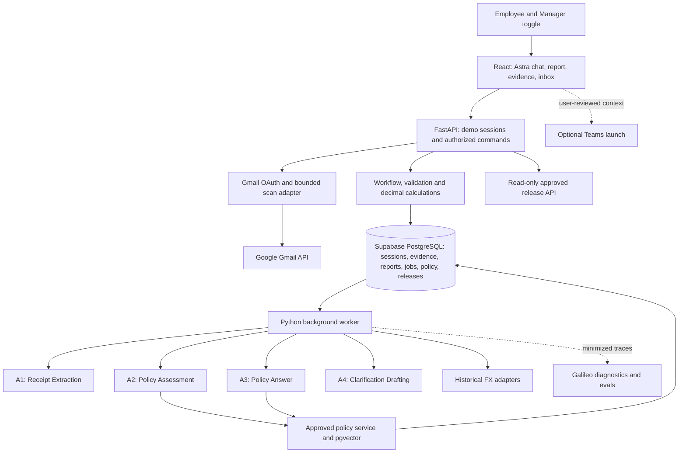

# Unloop — Architecture

**Prepare expenses. Understand policy. Resolve blockers.**

Updated: 7 October 2026  
Owner: Abhinav  
Status: Phase 1A verified locally and on live Supabase, merged in PR #1. Phase 1B shared uploads/evidence/leased validation jobs implemented; its hosted/live gates pending. Gmail and Phases 2–6 remain design. See [current ledger](docs/product/BUILD_STATUS.md).

[Vision](Unloop_Vision.md) governs product behaviour; [build plan](BUILD_PLAN.md) governs sequencing. This revision replaces Supabase employee/manager login, manual-only intake and required employee-led post-submission splitting. Previous designs and rendered diagrams are in [archive](archive/README.md). The map below reflects current responsibilities, not completed integrations.

The user explicitly selected FastAPI/Python during Phase 1A, superseding the Flask framework references in the preserved build plan. [Phase 1A evidence](docs/validation/PHASE_1A_VALIDATION.md) records actual implementation, tests and external gates. Astra header intake is deterministic; no model is used in 1A.

## 1. System shape

One React interface, one Python/FastAPI codebase, a background worker, four bounded AI specialists and one PostgreSQL database with pgvector. Railway runs the web service and worker as separate processes sharing business rules. Supabase hosts PostgreSQL; employee/manager Supabase Auth is not used in the current demo. Original document bytes stay in PostgreSQL, without separate Supabase Storage buckets.

Code validates every model result and owns writes, arithmetic, eligibility and approvals. No general-purpose supervisor has authority to change workflow state. Gmail credentials and broad mailbox access belong to the server adapter, not Astra's model context.

## 2. Stack and implementation status

| Layer | Current design |
|---|---|
| UI | React, TypeScript and Vite; persona/report workspace plus separate synthetic Meal preview |
| Backend | Python/FastAPI; sessions/personas, confirmed reports, evidence uploads/private originals and health/readiness; later workflows unimplemented |
| Agent orchestration | OpenAI Agents SDK, code-controlled specialist execution; not yet integrated |
| Models | Luna named baseline, exact available API identifier to be pinned; Sol only after measured comparison, no automatic upgrade |
| Database/files | Supabase PostgreSQL; original receipt bytes separated from report-list rows; Phase 1A Supabase persistence verified; Phase 1B isolated live evidence gate pending |
| Retrieval | pgvector, approved clause-linked snapshots; small embedding baseline pinned with index configuration |
| Sessions/personas | Implemented server-owned isolated demo sessions and Employee/Manager toggle; no app login/logout |
| Gmail | Existing user-confirmed GCP setup for aban.hackathon@gmail.com; adapter/callback/scan still to be integrated and verified here |
| Jobs | Leased PostgreSQL evidence-validation jobs and Python worker; 3 attempts/30s leases/15s validation deadline, no extraction yet |
| FX | Saved observation → Frankfurter pinned to ECB → Open Exchange Rates fallback under accepted date/basis rules |
| Diagnostics/evals | Existing project-specific Galileo choice retained; deterministic tests use pytest |
| Hosting | Railway web service serving built React/FastAPI and a separate worker |
| Libraries | Pydantic validation, SQLAlchemy/Alembic migrations and pytest; add dependencies when integrations use them |

Project-specific Galileo remains the earlier agreed baseline; changing it to the general preferred promptfoo/Langfuse/Phoenix stack would be a separate tooling decision, not a hidden consequence of workflow changes. Preserve one diagnostic pipeline per run and measure quality/cost before model changes.

## 3. Demo ownership and authority

On first use create a server-owned demo session with an opaque random identifier in an httpOnly cookie, expiry and predefined employee/manager identities. Use Secure cookies on Railway, appropriate SameSite policy and server-side checks against cross-site mutation. Exact session lifetime is an implementation setting to document before use.

The active persona is server-validated. The owner may toggle between both demo views; this is deliberate demonstration access, not separation between two independently authenticated humans. All documents, reports, conversations, jobs, inboxes and Gmail connections are session-scoped. Knowing an object ID cannot grant another session access. Switching personas must not create a new owner or connect the manager to employee Gmail tokens.

Seed employee grade on the server. Model output, email addresses and editable forms cannot assign a trusted grade. Demo manager routing is predefined; do not request manager details at report creation. Optional Teams identities come from separate controlled demo configuration.

Manager view exposes only submitted snapshots and relevant approved/history views in its session. Unsubmitted lines and later unsubmitted corrections remain employee-only. The current release is not safe for arbitrary real organizations simply because a persona toggle works. Production needs persistent ownership, tenant/role checks and actual manager relationships. Optional Google sign-in can provide an identity route without a separate password; Gmail OAuth alone is mailbox authorization, not the complete application identity/role contract.

## 4. Components and contracts

| Component | Authority |
|---|---|
| React workspace | Presents chat, report header, lines, receipt, policy sources and inbox; opens the relevant line when Astra asks; never decides eligibility |
| FastAPI API | Checks session/persona/object access and validates commands, files and external callbacks |
| Workflow service | Owns expense/report revisions, submitted sets, questions, immutable approval releases and inbox/processing-ready events |
| Calculation/validation service | Decimal amounts, date/currency validation, applicable fields, FX, caps, duplicates, claim totals and deterministic policy rules |
| Evidence pipeline | Stores bytes/provenance, deduplicates uploads/imports and creates recoverable extraction jobs |
| Gmail adapter | Owns OAuth state/tokens and consent-bound scans; no mailbox credentials passed to agents |
| Policy service | Approved source registry, versions, required-rule checklist, pgvector retrieval and citation validation |
| Worker | Leased jobs, bounded calls/retries, stale-result rejection and validated persistence |
| Adapters | Model/embedding, FX and diagnostics; no arbitrary URLs or ambient credential access for agents |

Report intake proposes only name, date range/year and purpose, validates formats/ambiguity and requires user confirmation. It is a bounded intake operation. Use deterministic parsing where it suffices; any model parsing has a strict schema and no write/tool authority. It does not introduce an unrestricted supervisor or change the four expense specialist responsibilities.

| Specialist | Inputs and output | Forbidden authority |
|---|---|---|
| A1 Receipt Extraction | Authorized receipt/supporting bundle → facts, suggested category, evidence references, missing/conflicting fields | Policy permission, FX/cap arithmetic, submission, approval, Gmail search or database writes |
| A2 Policy Assessment | Validated active facts, seeded policy attributes, deterministic findings and applicable sources → supported finding/explanation/clauses | Override arithmetic/rules, change facts, grant exceptions or approve |
| A3 Policy Answer | Bounded question/context and authorized policy retrieval → answer, sources, clarification or inability to answer | Change compliance, edit/submit/approve, arbitrary web browsing |
| A4 Clarification Drafting | Recorded issue/question and permitted context → targeted question or user-reviewed Teams opening | Send/read chat, invent agreement, resolve a question or mutate workflow |

Specialists do not call one another freely. Code decides which runs; not every action invokes all four. Missing-field templates provide fallback wording. [A1 contract](docs/agents/Receipt_Extraction_Agent.md) pins fact/evidence validation and human precedence.

## 5. Intake and receipt-to-claim flow

1. Employee confirms report header; code creates a session-owned draft with predefined manager routing.
2. Manual upload or explicitly authorized Gmail scan obtains evidence. Validate JPEG/PNG/PDF signature, bytes/pages and limits; store original bytes/provenance and queue work transactionally. Preserve failed/partial imports for recovery.
3. Worker sends only the authorized candidate bundle to A1. Receipt text is untrusted content. Validate schema, identifiers, evidence references, dates/currency/decimals, applicable fields and locked human corrections.
4. Persist accepted suggestions against the revision. Uncertain/absent required facts remain issues. Astra asks in chat and the UI automatically selects/opens the associated line and receipt. An inbox/history Open expense control returns to that same context. A response creates a revision, not a live suspended model session.
5. With sufficient facts, code reuses/fetches historical FX, computes full GBP value and permitted claim/excess, and checks deterministic rules against the applicable policy version.
6. A2 explains supported findings using the same approved sources. Validate clause IDs and required-rule coverage; missing coverage cannot unlock submission. Persist results with input/source versions.
7. Employee reviews saved output. Reopening retrieves stored values without model/rate calls. Corrections invalidate only dependent calculations and preserve locked human fields on re-extraction.

Candidate starting upload limits are 10 MiB/document, ten pages and ten files/batch. These unify the previous inconsistent page limits and are not production measurements. Confirm limits and per-report budgets during Phases 1–2.

## 6. Gmail integration boundary

Reuse one Google Cloud application, with a configured demo mailbox **aban.hackathon@gmail.com**. Implement authorization-code exchange server-side, exact allowed callbacks, session-bound single-use state and encrypted access/refresh tokens. Successful consent creates a connection; the user separately authorizes each bounded report scan. [Detailed Gmail design](docs/integrations/GMAIL.md) covers search, provenance, partial failures and public onboarding.

The adapter searches candidate messages/attachments within the disclosed window, retains mailbox/message/attachment metadata and passes validated bytes to the shared evidence pipeline. No mailbox-wide content is supplied to a specialist. No continuous monitoring, mail sending or editing is included. Imported records retain document source as Gmail; uploaded records retain upload provenance, and both are equally valid inputs to submission.

Removing a connection stops new access and deletes locally stored tokens; support provider revocation. Retained evidence needs a separate explicit retention/deletion rule. A demo session ending must not leave a reusable orphan connection. Google verification and persistent owner isolation are future public-release gates, not implied by the existing GCP setup.

## 7. Data and financial contracts

Introduce tables by phase: demo_sessions and seeded profiles; reports and revisions; expenses/revisions; documents and evidence links/provenance; jobs; Gmail connections/OAuth states/scan authorizations; policy sources/chunks/index configuration; FX observations; questions/responses; submitted snapshots; approval releases/approved lines; inbox events and processing-ready records.

Use stable opaque IDs and foreign keys constrained to the owning session. Document bytes are separate from list rows and fetched through authorized endpoints only when viewed. Hashes deduplicate within the appropriate owner scope; receipt matching needs human review when ambiguous. Preserve original files and source references rather than replacing evidence with model output.

Required money distinctions: originalAmount/originalCurrency; fullGbpReceiptAmount; claimAmountGbp; excludedExcessGbp; applicable policy/version; receipt date; immutable FX observation with requested/actual date, source/pair/rate and retrieval metadata. Reports sum eligible GBP claims, never mixed original currencies. Decimal arithmetic and an agreed rounding convention are mandatory.

Meal caps are £15/£25/£50, applied after full conversion. Listed tips/service charges stay within the cap. Meal uniqueness is keyed to the stable demo employee within its session, receipt date and meal type across drafts/submissions/approved history. Exclusion releases a slot; re-opening an approved report does not. Several smaller receipts cannot pool an allowance.

Air grade maximums are enforced in code: A–C Economy, D–F Premium Economy, G Business. Cabin needs evidence; missing grade pauses, and manager approval cannot waive the rule. Ground Transport rules must be reviewed before use. Inactive category fields cannot influence checks or export.

FX uses saved acceptable observations, then Frankfurter with ECB explicitly selected, then the agreed Open Exchange Rates fallback. Validate actual provider dates against the receipt date. Derive fallback cross-rates from one same-date snapshot; never mix providers/dates or relabel earlier observations. Preserve fallback basis/reason. Exact-date weekends/holidays and unpublished same-day rates stay pending unless a new policy exception is explicitly agreed. Never replace today's/approved saved conversion on report read or primary recovery. Exact provider access, terms and interfaces are verified when adapters are implemented; archived provider alternatives are not integrations to build.

## 8. Policy retrieval and guidance

Retain approved policy/FAQ snapshots with stable clause IDs, owner, source version/effective date, provenance, precedence and ingestion metadata. Initially activate one approved applicable policy version; the draft still needs an effective date and Ground Transport clauses. A newer draft cannot silently replace the policy tied to a saved assessment/release.

pgvector is a rebuildable index in PostgreSQL. Pin embedding configuration with its source set; atomically activate aligned sources/index and filter ownership/version/applicability before passages reach A2/A3. Use exact clause/term lookup alongside similarity where useful. A2 receives a required-rule checklist/core policy text so top-k retrieval is not mistaken for exhaustive review.

A3 returns sources from supplied approved identifiers only. Code validates references/quoted passages; grounded-looking citations do not themselves prove correct interpretation. Compare RAG with full-policy context on held-out cases. Missing/conflicting guidance leads to an honest limitation; unavailable retrieval leads to retry, not a policy decision. A general Q&A answer cannot mutate an expense or create specialist referral automatically.

## 9. Submission, partial release and inbox consistency

Eligibility is calculated server-side for each current expense revision. Employee submission freezes the chosen line set and header/context with versions. If other lines remain unresolved, keep them as drafts and exclude them from the manager's submitted view. A successful submission atomically writes the submitted snapshot and both inbox events, with idempotency keys.

Manager questions are linked to line and submitted version. Asking does not reject unrelated lines. Responses/corrections create new working revisions; material changes need validation and explicit resubmission. Manager never approves a hidden draft revision.

For partial approval, validate selected submitted lines under a transaction and record a stable **approval release** with immutable line IDs, facts, FX, policy, approved amounts and input versions. Held/returned lines are not included. Enforce uniqueness so the same expense's claim cannot be released twice. Processing-ready and inbox events are written with that release transaction, not loosely after it.

A report with approved and unresolved lines is Partially approved. Nine approved lines in a ten-line report can progress while one remains held/returned. The tenth can later generate another explicit approved release after resolution/resubmission. Keep stable expense IDs; do not clone expenses or require an employee-created `-1` follow-up report for manager discretion. The earlier linked-split design is archived, not an active dependency.

Manager approval binds to exactly the previewed submitted version and selected set. Revision checks prevent concurrent edits or stale selection from approving changed facts. Earlier releases never change. Only when every line has a terminal recorded outcome and no active question remains may the report complete; exact UI labels are finalized in Phase 5. Approved amount, pending amount and next action must be clear in both inboxes. Notifications are durable in-app events; no external push/email is claimed.

Optional Teams launch uses separately configured demo participants and A4's minimal, user-reviewed opening context. Never embed receipt contents or tokens in a link. The other session/persona's access is not transferred by an expense URL. Do not read private Teams chat or treat launching as proof of sending/resolution. An explicit recorded human outcome is required.

## 10. Jobs, recovery and operational limits

Use a durable PostgreSQL queue and worker, not request-local fire-and-forget calls. Claim due jobs in a short transaction with row locking/leases, commit before network work, cap attempts and retry only transient failures with backoff. Recover expired leases. No lock remains held while waiting for a provider or human.

Execution is at least once. Idempotent writes and revision/source checks prevent repeated calls from duplicating output or overwriting newer human work. A crash may incur another model call/cost; do not claim exactly-once external execution. Set call deadlines, turn/tool limits, concurrency and per-report spend before paid experiments. One schema repair can fix format; it cannot pressure a model to invent missing facts.

| Failure | Recovery |
|---|---|
| Missing/unreadable/conflicting evidence | Keep draft/evidence; ask a precise question or clearer upload |
| Invalid output or unknown reference | Reject, bounded repair if structural, then show processing failure |
| Gmail denial/revocation/empty/partial scan | Explain outcome, retain visible imported evidence, reconnect/retry or upload |
| Missing or wrong-date FX | Conversion pending, preserve original amount and retry under policy |
| Missing policy coverage | Explain limitation; do not fabricate permission or denial |
| Genuine unresolved policy ambiguity | Labelled simulated T&E inbox item; no actual specialist or approval |
| Model/FX/retrieval outage | Bounded recovery; separate technical failure from policy judgment |
| Galileo outage | Retain business records and minimal operational metadata; surface monitoring failure |
| Teams unavailable | Preserve in-app question and copyable context; explicit app resolution still required |

Load report fields without file bytes, fetch selected evidence on demand and prioritize interactive questions over bulk jobs where possible. Measure report/receipt opening separately from extraction/Q&A latency.

## 11. Security, privacy and API

Check server-owned session and persona access on every command, file, job, inbox and conversation endpoint. Uploaded files, Gmail messages, policy documents and user text are untrusted data: they cannot grant roles, override instructions, select arbitrary network destinations or authorize workflow writes. Validate file formats and escape generated UI output. Agents receive no DB credentials, shell, general browser or workflow-mutation tools.

Keep database/model/Gmail/diagnostic secrets server-side; encrypted Gmail tokens need a managed server key and tested rotation/reconnect handling. Do not print credentials, OAuth codes or receipt content into logs. Minimize authorized evidence/passages sent to model providers and diagnostic services; data does leave the app through these integrations. Start with synthetic inputs, document retention/deletion and backup/restore before real-data claims.

The UI API supports session-owned reports/evidence/jobs, policy questions, scan permissions, submission and explicit manager decisions. The read-only approved-data API has separate server-side downstream access control; the toggle does not grant arbitrary external API access.

Export stable reportId, expenseId, approvalReleaseId, approved revision, merchant/date/category, original amount/currency, full GBP receipt value, approved GBP claim and release total. Partially approved reports expose only their approved release snapshots, with totals clearly identified as approved totals. Pending/draft lines never contribute. Exclude files, Gmail credentials/provenance details, policy explanations, conversations and internal workflow history. Repeated reads preserve the same identities/version for deduplication. No downstream payment/ERP receiver or automatic push is included.

## 12. Evaluation, iteration and readiness

Trace specialist runs from first live execution with model/prompt/schema/policy versions, outcome, latency/tokens/cost and minimized payloads. Galileo diagnostics are not the authoritative financial record. Keep deterministic tests separate from model-quality evals, and avoid duplicate tracing pipelines. The general preferred tooling stack does not silently override this project's earlier selection.

Use labelled development/held-out examples, critical hallucination/injection cases, policy-source tests, session isolation, stale job and partial approval concurrency checks. Compare RAG against full-policy context and stronger models only on diagnosed errors. [Build gates](BUILD_PLAN.md#8-evaluation-and-release-gates) set proposed thresholds; none is an achieved production claim.

Preserve correction history to respect human precedence and inspect revisions. Correction-derived memory, fine-tuning, training and automatic correction-to-eval collection remain excluded. Synthetic regression/evaluation work and the engineering [iteration log](docs/product/PRODUCT_ITERATION_LOG.md) still measure improvements.

Remaining detailed settings are phase-scoped: exact model/provider access, limits/budgets, rounding/policy date, Ground Transport rules, source-version selection, release schema, session/token retention and operational checks. Integration sign-off requires real Gmail bytes on Railway, real extraction and both FX adapters, contextual sources, line resubmission/partial approval, approved API and tested session isolation. A configured secret or mocked successful call is not that evidence. See [README](README.md) for what currently runs.
