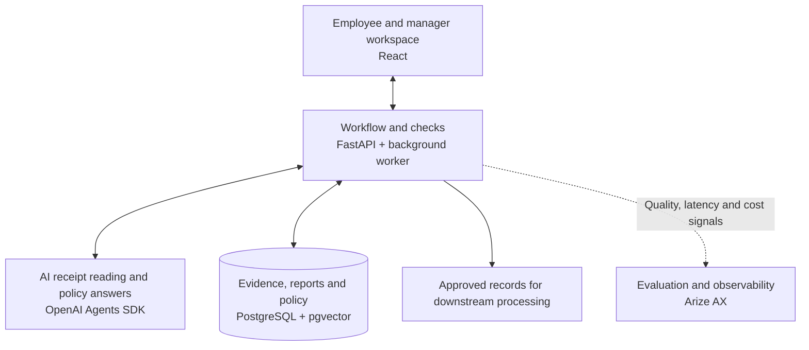

# Scout

**Prepare expenses. Understand policy. Resolve blockers.**

Scout helps employees turn receipts into expense reports that managers can review. It brings receipt preparation, policy guidance and questions about individual expenses into one workspace, so a disputed item does not have to hold up the rest of a claim.

The goal is to reduce preparation effort while keeping financial decisions accurate and under human control.

## The problem

Employees collect receipts, re-enter details, interpret travel policy and explain exceptions across disconnected tools. Managers need enough context to approve eligible expenses without losing track of unresolved ones.

Scout brings the receipt, relevant policy and review conversation together around each expense. Employees can see what needs attention, and managers can act on eligible claims without blocking the entire report.

## How it works

1. **Describe the trip.** Scout proposes a report name, explicit dates and business purpose. The employee reviews and confirms them.
2. **Add receipts.** Upload images or PDFs. An optional Gmail integration is designed to import attachments after explicit consent and a confirmed scan.
3. **Review the preparation.** AI suggests receipt facts and answers questions using approved policy sources. The employee checks the evidence, corrects details and resolves missing information.
4. **Submit ready expenses.** The employee previews and submits eligible lines. Unresolved lines stay private in the draft.
5. **Approve and resolve.** The manager reviews submitted expenses, asks questions about specific lines and can approve eligible items while holding others. Approved records are available for downstream processing; the app does not make payments.

For example, under the demo policy, a **£62 dinner** keeps its original receipt value and shows a **£50 claim with £12 excluded**. If one expense in a ten-line report needs clarification, the manager can approve the other nine. Corrections to the remaining item require a fresh review and submission.

The demo supports **Meals, Air and Ground Transport**, with claims in GBP and an owner-reviewed synthetic travel policy. Accommodation, payment execution and ERP posting are outside its scope.

## Where AI adds value

AI helps interpret varied receipts and policy language. Predictable rules and consequential actions stay in application code or with people.

| Responsibility | Who handles it | Why |
| --- | --- | --- |
| Read receipts and answer policy questions with citations | Bounded AI calls through the OpenAI Agents SDK | These tasks involve varied documents and language. |
| Parse report headers, calculate amounts, apply policy limits and prevent duplicate claims | Application code | These outcomes need consistent, testable rules. |
| Correct facts, submit expenses and approve claims | Employee and manager | People remain accountable for the final decisions. |

Missing evidence, unavailable exchange rates and unsupported policy questions remain explicit unresolved states. AI cannot waive policy, submit a report or approve a claim. Human corrections survive later processing, and approved records preserve the exact version reviewed.

## Architecture at a glance

The application validates AI suggestions and retains evidence and review history. Policy answers retrieve approved sources through pgvector; Arize AX supports evaluation and monitoring. See the [architecture guide](Architecture.md) for system details.

## Evaluation approach

Evaluation separates **working software**, **model quality** and **user value**: each needs its own evidence.

| Product question | Evaluation method |
| --- | --- |
| Does preparation take less effort? | Compare active preparation time on matched manual and assisted tasks, measuring system waiting time separately. |
| Can employees trust extracted facts? | Check required-field accuracy on held-out receipts and whether incorrect critical financial facts are caught before submission. |
| Is policy guidance useful and grounded? | Review answer correctness and supporting citations. Compare retrieval against a full-policy-context baseline. |
| Do eligible claims progress safely? | Verify partial approval, private drafts, duplicate prevention and unchanged approved records through database and browser tests. |
| Is the experience practical to operate? | Track latency, failed jobs, retries, token usage and cost per workflow, with persistent limits on paid calls. |

Development and held-out examples are kept separate. Database and browser tests use controlled inputs to check workflow behaviour; model evaluation assesses receipt interpretation and policy answers independently.

## Try it locally

Follow the [local setup and validation guide](docs/product/LOCAL_DEVELOPMENT.md) for dependencies, configuration, database migrations and service commands. Report creation and manual receipt validation work without model credentials. Use synthetic receipts; the Employee/Manager switch lets you explore both journeys within one demo session.

Once running, try:

> “Prepare my London expense report for 1–4 October 2026 for a client workshop.”

Confirm the report details, upload a sample receipt and inspect its evidence. Extraction and live policy answers need the separately configured providers; manual validation confirms file structure, not extracted expense facts.

## Explore the project

| Read next | What you will find |
| --- | --- |
| [Product vision](Unloop_Vision.md) | Users, scope, journeys and product boundaries |
| [Product case study](docs/product/PORTFOLIO_CASE_STUDY.md) | Product decisions, tradeoffs and evidence from iteration |
| [Iteration log](docs/product/PRODUCT_ITERATION_LOG.md) | Hypotheses, results and decisions |
| [Architecture](Architecture.md) | System design and trust boundaries |
| [Supporting documentation](docs/README.md) | Policy, integrations, setup and validation records |
