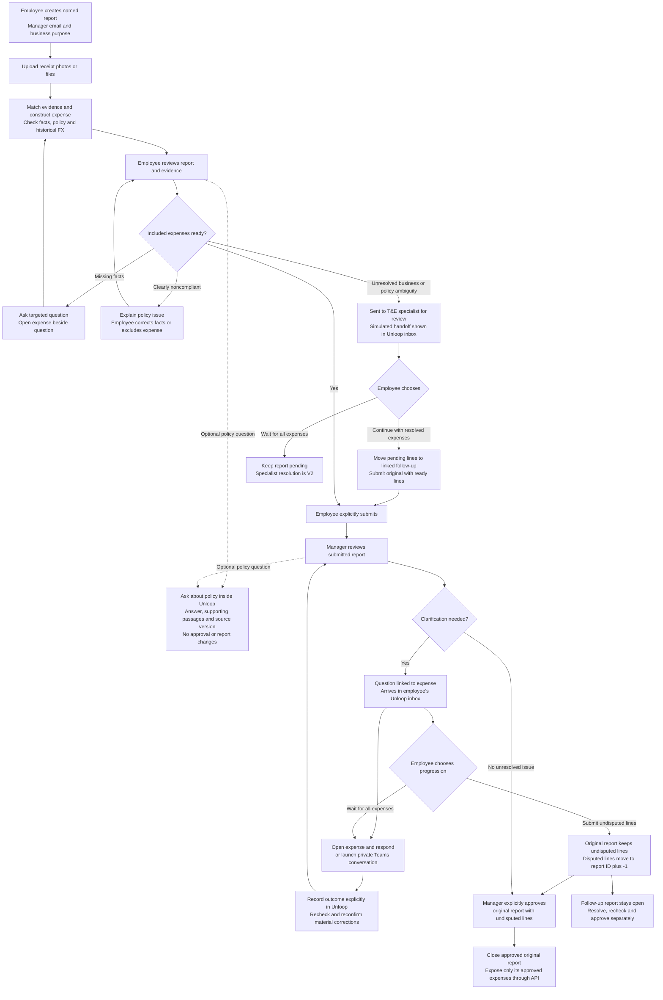

# Unloop — Product Vision

**User → Problem → Desired outcome → Product → Journey → Trust → Proof**

Updated: 28 September 2026  
Owner: Abhinav  
Stage: product definition for an Air, Meals and Ground Transport proof of concept

This document is the source of truth for the current product direction. It describes intended behaviour, not features already implemented or validated. [Architecture.md](Architecture.md) records the agreed high-level architecture baseline v1.0 and distinguishes it from remaining detailed design and validation. [Synthetic_T&E_Policy.md](Synthetic_T&E_Policy.md) is the draft RAG source for governing policy; its Air and Meals rules are defined, while Ground Transport rules remain pending. Open product design choices are identified at the end.

Current scope: two personas, employee and manager. Receipt photo/file upload supports real expense preparation and contextual clarification. An in-app policy assistant answers questions using approved policy and guidance, with supporting passages visible beside the report. PostgreSQL holds the POC's business records, original receipts and policy sources; pgvector adds policy retrieval within the same database. Employees may split pending expenses into a linked follow-up report or wait for the whole report. Notifications outside Unloop and actual T&E specialist handling are V2; V1 only simulates the T&E handoff. Price intelligence and airline-discount contract configuration are removed from the POC. Report creation remains before evidence intake.

## 1. User — who Unloop serves

Unloop starts with a UK-based employee who travels for work and submits reimbursable expenses: a consultant, client-facing professional or field employee. The employee wants to complete the administrative work accurately with as little repeated effort as possible.

| Person | Job to be done | Value Unloop should deliver |
|---|---|---|
| Employee / report owner | Turn travel evidence into a complete expense report and resolve questions | Less file handling, typing, policy searching and context reconstruction |
| Manager | Understand business expenditure, consult policy and clarify specific concerns before approving | Policy, evidence and questions attached to the right expense; no whole-report rejection just to ask a question |

These are the only two V1 personas. A simulated T&E referral is a status and inbox item, not a third user, login or working specialist queue. Finance/T&E leadership may be a future buyer; that does not add a V1 interface or role. Company size, first commercial segment and willingness to pay remain hypotheses.

## 2. Problem — the employee carries context between disconnected systems

The observed workflow spans a booking portal, email, an expense platform, policy documents or guidance webpages, and a separate conversation tool. The employee repeatedly moves documents, searches for policy and explains information those systems already contain.

### Three primary friction points

| User friction | Unloop's response | POC boundary |
|---|---|---|
| **Report preparation:** "I have to build the report myself." Users handle receipts and re-enter facts already present in them. | Prepare expense records from uploaded evidence; the employee reviews and corrects them. | Users still source and upload receipts. Universal automatic receipt collection is not solved by this POC. |
| **Policy understanding:** "I have to leave my report to understand the rules." Users search documents and guidance pages, interpret policy, or ask colleagues. | Explain applicable policy in context, with inspectable supporting passages inside Unloop. | Approved synthetic sources only; missing or conflicting guidance is not invented. |
| **Dispute resolution and progress:** "One disputed expense holds everything up." Users reconstruct context in another channel and wait for the whole report. | Keep questions linked to the expense, prepare Teams opening context, and let eligible undisputed expenses proceed through an explicit report split. | Manager approval remains explicit. Private Teams conversations stay outside Unloop; proactive notifications are V2. |

**Prepare expenses. Understand policy. Resolve blockers.** These are the three core value propositions, not verified claims that every capability is absent from competing products. The POC must demonstrate improvements against the observed workflow and measure the resulting effort and quality.

Our initial evidence is Abhinav's experience with one SAP Concur configuration: an 18-line report took an estimated 60–90 minutes, including receipt sourcing. It contained 11 taxi/ride-share expenses, five meals, one hotel and one flight. This is a useful directional baseline, not a controlled measurement of the POC's supported categories or proof that every incumbent workflow has the same limitations.

## 3. Desired outcome — review and resolve, with less repeated work

> When I travel for work, help me turn my receipts into a correct expense report, understand the applicable policy without leaving my report, and resolve a manager's question without explaining everything again or holding up unrelated expenses.

The employee remains accountable for submission. The manager remains accountable for business approval. Unloop prepares the record, connects the evidence and makes the next action clear.

## 4. Product vision — one connected expense journey

**Unloop prepares business expenses from travel evidence, explains policy in context, and helps employees and managers resolve questions with the context already attached.**

The intended differentiation is less repeated typing, evidence handling, policy searching and context reconstruction, plus the choice to progress undisputed expenses. The POC must demonstrate preparation, in-context policy guidance, review and clarification working together. The employee supplies receipt photos or files; universal automatic supplier delivery is not part of this proof. Removing every receipt-collection step remains an integration opportunity rather than a demonstrated claim.

Unloop is the expense application and evidence record in this POC. It does not need a Concur integration or a functioning ERP receiver. Approved core T&E data is exposed through an authenticated API; payment processing stays outside the boundary.

### Why AI, and where it stops

| AI helps with | Conventional software owns | People decide |
|---|---|---|
| Reading variable receipts and supporting confirmations | Total and FX calculations | Review of populated expense facts |
| Classifying expenses and matching evidence when explicit IDs are insufficient | Identity, access and record linking | Answers to missing factual questions |
| Answering policy questions and explaining relevant clauses with supporting passages | Source access, applicable policy versions, validation and workflow gates | Inspection of policy evidence, factual corrections and expense exclusions |
| Explaining an unresolved issue using available evidence | Report splitting, evidence retention and approval/export boundaries | Submit undisputed lines or wait; resolve questions and approve |
| Drafting focused questions and opening chat context | Enforcing no-access boundaries for private chat | Whether to send the drafted Teams message |

The model must not invent a receipt fact or policy clause. AI output is a candidate interpretation until supported and checked. Retrieval and citations do not guarantee a correct interpretation. Financial arithmetic and permission to progress never depend on a model's assertion alone; a policy-chat answer is not approval.

## 5. First proof — receipt to approved expense, with two personas

The POC starts with the following agreed categories. It is not flights-only:

| Category | Supported types / subcategories |
|---|---|
| Air | One-way and return journeys |
| Meals | Breakfast, Lunch, Dinner |
| Ground Transport | Public transport, Taxi |

No actual ticket purchase or payment occurs. Synthetic receipts and supporting confirmations can supply test evidence; the extraction, classification, policy checks, report workflow and split must actually work. A booking simulator is not required to prove photo/file receipt intake. Accommodation is outside this starting scope.

### Company policy remains; price intelligence is removed

Unloop evaluates expenses against a synthetic T&E policy reviewed for the demo, with a small set of approved supporting FAQs or guidance pages. Source preparation is demo setup, not an administrator persona. There is no live flight-price search, comparable-price database, simulated corporate-price calculation or airline-discount configuration in the current POC. Those features have no automatic V2 commitment.

### Policy guidance without leaving Unloop

Both personas can select **Ask about policy** to open a panel beside a report or expense they are authorised to view. The selected expense supplies relevant context, so the user need not reconstruct it. General policy questions are also supported without selecting an expense. This is a feature inside Unloop, not a separate application or persona.

The assistant retrieves relevant passages from the approved source set, then uses them to explain what the policy says, how it applies and what facts are still needed. This retrieval-augmented generation (RAG) workflow shows a concise answer with supporting excerpts, source title, section or page, and policy version/effective date. Users can inspect the evidence inside Unloop and optionally follow the original document or webpage link. A question such as "Can I claim this checked-baggage charge?" must be answered from the demo's actual policy, not an assumed company rule.

Only authorised, reviewed source copies are ingested. For the POC, these are the synthetic policy and supporting guidance snapshots prepared for the demo; live corporate-intranet connections, automatic webpage crawling and open-web policy search are not included. Record source identity, original location where available, version/effective dates and ingestion time. Policy Q&A and automated expense checks use the same applicable source versions. Search results must respect source permissions and applicability; an outdated or conflicting passage must not silently become the governing rule. Retrieved documents are evidence, not instructions that can alter the assistant's behaviour or access rights.

The panel is read-only with respect to expense facts and workflow. It cannot silently edit an expense, submit or split a report, approve a claim or override policy. Missing facts prompt a targeted question. Missing or conflicting policy evidence produces an explicit limitation, not invented permission or automatic denial. Expense-linked unresolved business/policy ambiguity uses the existing, clearly labelled simulated T&E handoff. A general policy question alone does not create a specialist case; a retrieval outage calls for retry/recovery, not a fabricated policy answer.

### POC storage decision — one database, including policy retrieval

Use PostgreSQL for reports, expenses, original receipt files, original policy/guidance snapshots, FX records and workflow history. Store receipt file contents separately from expense rows within that database and fetch them only when needed; apply upload-size and volume limits. There is no separate receipt-storage service in this POC.

Supabase is agreed to host this PostgreSQL database and provide authentication; Railway is agreed for application hosting. This preserves the single-database decision: original receipt files remain in PostgreSQL, without introducing separate Supabase Storage buckets.

Use the **pgvector extension within PostgreSQL** to hold searchable policy embeddings alongside source-linked excerpts and metadata. This is a derived retrieval index, rebuildable from the retained policy sources, not a second source of policy authority. Source/version changes must keep the index aligned with the source set used for expense checks. Qdrant is not included. The decision prioritises fewer components for the POC; it does not claim that one database automatically produces lower latency or better answers.

### An inbox owned by Unloop

The Unloop inbox surfaces expense questions and simulated T&E handoff updates for the employee, and submitted reports for the manager. Uploaded evidence is associated with the relevant report and expense. Unloop does not monitor or connect to personal or corporate email accounts.

Employees upload receipt photos or files, individually or in a batch. A supporting booking confirmation supplies context but does not automatically substitute for the required invoice/receipt. Direct supplier delivery, forwarding and a dedicated receipt address are future intake options, not requirements for this POC. Card transactions can help identify expenditure, but do not replace a required receipt; a card-feed integration is not included.

Manager questions and simulated T&E handoffs appear inside Unloop. Proactive notifications outside the app are deferred to V2. The V1 user checks the Unloop inbox; we must not claim immediate awareness when the user is away. Opening Teams is a user action, not automatic notification or proof of delivery.

## 6. Visual journey — receipt to approved expense

The employee chooses whether to wait for the full report or move pending lines into a linked follow-up report so the remaining expenses can proceed.

Only complete, compliant, resolved expenses are eligible for submission and approval. If none qualify, there is nothing to submit or close. Pending expenses remain visible in the linked follow-up report and do not become employee-funded merely because Unloop cannot resolve them. Closing an approved report means its Unloop workflow is complete; it does not claim that payment has occurred.

The optional policy panel leaves the report and review context in place. Users inspect the answer and evidence, then continue the existing review flow. Its answer does not change an expense's compliance or approval status by itself. Missing facts, unresolved policy issues and technical failures follow their distinct handling paths above.

## 7. Journey explained — what each person experiences

### Step 1 — prepare the demo policy

The draft [synthetic T&E policy](Synthetic_T&E_Policy.md) now defines the agreed Air evidence, trusted-grade, cabin and FX clauses, plus the Meals rules, with stable citation IDs. The Meal limits are £15 for Breakfast, £25 for Lunch and £50 for Dinner. The complete receipt total, including tips and service charges, is subject to that limit without separate itemisation. For each employee, date and meal type, only one Meal expense from one restaurant with one final receipt may be claimed. The allowance is not a pool: several smaller receipts cannot be added together up to the limit. The policy must receive an effective date and owner approval before activation. Ground Transport clauses, supporting FAQs/guidance, source-applicability rules across future versions and labelled policy-question test cases remain design work. Retain approved source snapshots in PostgreSQL and prepare their pgvector search index before the demo. No administrator or specialist login is required in V1; employee and manager are the two product personas.

### Step 2 — establish the report context

The employee enters the required report name and manager email, plus a reusable business purpose. Supabase authentication establishes identity. Server code then loads a trusted employee profile, including grade, using the authenticated user ID. Email can help provision or locate that profile but does not prove grade. For the POC, profiles are seeded and employees cannot edit their own grade. The manager stays fixed for this report. Shared purpose can be overridden on an individual expense where needed.

This supplies the recipient for future Teams conversations without asking the employee to select the manager again on each line. A typed email is a routing input; the manager must still authenticate and have access to the submitted report.

### Step 3 — provide evidence once

The employee uploads receipt photos or files into the named report. Supporting confirmations can be associated with the same expense. Unloop retains the source so the employee and manager can inspect it later without attaching it again. If required receipt evidence is absent, Unloop shows what is missing rather than fabricating an expense. Ambiguous matches need human resolution; repeated uploads must not produce duplicate expenses.

This does not eliminate receipt sourcing from every merchant. It reduces subsequent typing and repeated evidence handling, which the POC must measure rather than assume.

### Step 4 — prepare the report and ask only useful questions

Unloop extracts merchant, transaction date, receipt amount, currency and the details relevant to Air, Meals or Ground Transport, then checks supporting evidence and policy. AI suggests the category and, where supported by evidence, the subcategory; unclear classifications prompt a question. Breakfast, Lunch and Dinner must not be inferred from amount alone. VAT is populated only when explicit; otherwise it stays blank without blocking. The UK report total is in GBP, with original foreign-currency amounts retained and historical FX applied deterministically.

For Meals, the receipt amount remains unchanged as evidence. The GBP allowances are £15 for Breakfast, £25 for Lunch and £50 for Dinner. Once the meal type is known, deterministic code compares the full GBP receipt value with the applicable limit. If the receipt exceeds it, Unloop automatically caps the claim, shows **Adjusted to policy limit**, and explains the original amount, allowance, claim amount and excluded difference. The user reviews the adjustment but does not have to calculate or re-enter the permitted amount. AI may explain the reason; it does not perform the arithmetic. The report total and approved-data API use the capped claim amount, while the original receipt and full converted value remain available in Unloop.

For Air, cabin must be supported by the receipt or permitted booking confirmation. The employee can correct an extraction mistake, but an unsupported self-declaration cannot satisfy the cabin-policy check. Deterministic policy code compares cabin with the trusted grade profile using the synthetic maximum allowance: A–C Economy, D–F Premium Economy and G Business. Lower cabins remain permitted. A2 explains the resulting finding with the policy clause; it does not decide the fixed mapping. Missing grade is a profile-data failure, not permission to claim or a manager-overridable exception.

**Category-aware fields and human correction:** the category selector stays editable during expense preparation and correction. Fields that do not apply to the selected category remain visible but greyed out, with a readable “Not applicable” explanation rather than colour alone. For Meals, travel-specific fields are disabled; for Ground Transport, air-only fields such as cabin class are disabled. The employee can correct an AI classification, which enables the appropriate fields and reruns the relevant validation and policy checks. Disabled fields are not required and must not contribute stale values to policy decisions or the approved-data API. Changing category does not bypass normal submission or approval controls; closed approved reports remain immutable.

Frankfurter using ECB rates is the agreed primary FX source; Open Exchange Rates' free tier is the agreed fallback. Reuse valid saved rates first and preserve the source/date used. The fallback's historical rate basis differs from ECB's and is explicitly allowed for this POC, not presented as identical. If neither source provides an acceptable rate, preserve the expense with **Conversion pending** rather than guessing. Detailed date/rounding rules and integration tests remain before implementation sign-off.

### Agreed common expense fields

| Field | Population and behaviour |
|---|---|
| Category and applicable subcategory | AI suggests; employee can correct |
| Merchant / supplier | Extract from evidence |
| Transaction date | Extract from evidence; ask if unclear |
| Original total amount | Extract and preserve in the transaction currency |
| Transaction currency | Initially GBP; update when the evidence identifies another currency |
| VAT amount | Extract only when explicit; otherwise blank, without blocking |
| Full GBP receipt amount | Application calculates using the applicable historical FX rate; never overwritten by a policy cap |
| Claim amount in GBP | Full GBP receipt amount unless a policy rule deterministically reduces the reimbursable amount |
| Amount above policy limit | Difference excluded from the claim; zero or blank when no cap applies |
| Receipt | Employee uploads; application links the evidence |

Report name, business purpose and manager email are report-header context; employee identity comes from authentication. The agreed common and category-specific fields are formalised in [Receipt_Extraction_Agent.md](Receipt_Extraction_Agent.md).

**Agreed currency presentation and storage:** assume a UK-based company and fix submission currency to GBP. A USD receipt displays both the original USD amount and its GBP equivalent; recognising USD changes the transaction currency, never the submission currency. **FX conversion date must match the receipt date**, not the upload, processing or submission date. Ask if the receipt date is ambiguous. Show both amounts and that receipt-aligned conversion date, and store them with the actual provider rate date, rate and source. The calculation timestamp is internal processing metadata, not a second user-facing conversion date. Never overwrite the original amount or recalculate merely because the report opens. If no matching-date rate exists, leave conversion pending unless a different-date exception is explicitly agreed; never relabel an earlier rate as the receipt-date rate. Preserve the original amount without inventing a GBP value or presenting a partial total as complete; submission waits for required conversions.

The employee sees expense rows with original, full GBP receipt and claim amounts, plus a report total in GBP only, with issues attached to the relevant line. The report total sums the eligible GBP claim amounts, not full receipt values that policy has reduced and not a mixture of original currencies. Every question has an adjacent **Open expense** action. It opens the evidence and the fields needed to answer or correct that issue.

The employee can also open **Ask about policy** beside the report or expense. Unloop reuses relevant context, retrieves approved guidance and displays an explanation with inspectable source passages without requiring a new screen. The manager has the same facility when reviewing a submitted report they can access; it does not grant access to employee drafts. A policy explanation supports the person's review but does not replace the normal validation or approval gates.

Clear noncompliance is explained using the applicable policy. The employee may correct erroneous facts or exclude a genuinely noncompliant expense; a manager cannot override policy. A Meal exceeding an allowance follows the narrower automatic-cap rule: it may proceed at the adjusted claim amount and does not require the employee to edit the receipt amount.

When factual clarification cannot resolve a business/policy issue, or the interpretation remains highly ambiguous, V1 records a simulated handoff with the label **Sent to T&E specialist for review**. A corresponding Unloop inbox item identifies the expense, issue and relevant evidence. Clearly identify it as a demo handoff; no real specialist has been notified and no approval is implied. The expense remains pending, not denied or automatically assigned to the employee to pay. Specialist review and adjudication will be developed in V2.

Missing receipt evidence still requires a receipt, and technical failures still need retry/recovery. A simulated specialist handoff cannot manufacture either missing evidence or a successful processing result.

### Step 5 — choose whether to split or wait

Before initial submission, the employee can submit the complete, compliant and resolved expenses now, retaining pending lines in a linked follow-up report, or wait and submit the full report when all its lines are ready. Only explicitly submitted expenses reach the manager. User-facing approval tracking begins at submission.

After submission, a manager's line-specific dispute creates an item in the employee's Unloop inbox. The employee chooses **Submit undisputed lines** or **Wait for resolution**. Splitting is never automatic merely because a manager asks a question.

For example, report `UNL-1042` contains ten lines and the manager disputes one. If the employee chooses to proceed:

| Report | Contents after split | Outcome |
|---|---|---|
| `UNL-1042` | Nine undisputed, eligible expenses | Submitted for the manager's explicit approval, then processed and closed in Unloop |
| `UNL-1042-1` | The disputed expense with its evidence and question | Remains open until resolved, rechecked and explicitly approved |

The follow-up inherits the employee, fixed manager and applicable report context. It links back to the original. The original links to the follow-up so both people can find the pending expense. If the employee chooses to wait, all ten lines stay in the original and no follow-up is created.

The split moves the disputed expense; it does not create a second claim. Retain its identity, receipt, question and prior responses, recalculate both totals and record the split. The employee sees the resulting reports and totals when choosing to proceed. The manager's approval binds to the revised nine-line report; absence of a dispute alone is not approval.

Only approved reports are available through the approved-data API. The open `-1` report and its amount stay out until separately approved. Retries must not create another follow-up or export the same expense as a new claim. Multiple disputed lines can move together into the first follow-up; repeated-split suffix rules remain to be specified. Never reopen or alter the closed original simply because the follow-up later resolves.

Waiting for a simulated T&E case in V1 leaves the report pending; there is no hidden automatic resolution to make the demo pass. The option to progress other eligible lines remains available.

### Step 6 — use Teams without exposing private conversations

Either participant can select **Discuss in Teams** on the relevant submitted expense. Unloop drafts the opening context from its own data: report, expense, amount, question and link. It selects the other participant from the report identities. The initiator reviews and sends the message in Teams.

Unloop never reads, monitors, imports or summarizes the Teams conversation. Opening the chat does not prove a message was sent or an issue resolved. After discussion, a human records the outcome in Unloop and the manager explicitly resolves the question. A material expense correction is rechecked and reconfirmed by the employee.

### Step 7 — approve and retain an inspectable record

The manager approves each report in one action, rather than approving every routine line individually. After a split, the original and follow-up are distinct linked reports, each with its own approval and closure. Unloop retains supporting evidence and explicit decisions for the approved version. Teams chat is not part of the record.

An authenticated API exposes approved core T&E data. Receipts, explanations, policy evidence, internal workflow tracking, split history and approval history stay in Unloop. The POC does not send money or post to an ERP.

## 8. What the POC must prove

| Must work | May be simulated or remains constrained |
|---|---|
| Photo/file receipt upload, evidence association and expense construction | Synthetic documents can provide inputs; automatic supplier delivery is not claimed |
| Grounded extraction, policy explanations and targeted questions | Receipts and company policy are synthetic |
| In-app policy Q&A with real retrieval, contextual answers, inspectable citations and honest handling of uncertainty | A small approved synthetic policy/guidance set; no live intranet integration or arbitrary web search |
| Employee choice to split or wait; original closure and linked follow-up; explicit manager approval | Two demo personas and no real payment processing |
| Unloop inbox records an unresolved expense and simulated T&E handoff | Specialist adjudication is V2; the handoff must not imply real delivery or approval |
| Teams context launch with the intended recipient | No chat-content access or automatic resolution synchronization |
| Approved-data API and inspection of evidence | No external accounting receiver or payment execution |

This boundary should be visible in the demonstration. Core preparation, policy retrieval/Q&A and approval behaviour must work; synthetic documents and a labelled specialist handoff are the explicit simulation boundaries. The POC does not claim universal receipt collection, real bookings, verified customer savings or production readiness.

## 9. Success — evidence we intend to collect

The central test is whether the employee can complete the expense and resolve a question with less repeated work while the reviewer retains sufficient evidence.

| Outcome | Measurement |
|---|---|
| Less document handling | Manual download, transfer and upload actions per demo journey |
| Less report preparation | Active time, corrections and questions on matched baseline/Unloop tasks |
| Reliable facts | Required-field accuracy and unsupported-value count against labelled receipts |
| Policy understanding without screen switching | Active time, external navigation and successful resolution of labelled policy questions with source evidence visible inside Unloop |
| Reliable policy guidance | Retrieval relevance, answer and citation correctness, false permission to claim, appropriate questions/abstention, and consistency with automated checks using the same policy version |
| Easier clarification | Active time and actions from opening the question to explicit resolution; context re-entry required. Measure discovery delay separately because proactive notifications are V2. |
| Progress despite pending expenses | Original report approved/closed with eligible expenses while its follow-up remains open; no duplicate claims or lost evidence |
| Safe progression | Invalid reports blocked; approval bound to the correct version; no assumed Teams resolution |
| Feasible operation | Report-opening, receipt-opening, upload-to-draft and policy-answer latency; failures, retries and cost per completed journey |

These are intended measures, not achieved results. Freeze evaluation cases and thresholds before claiming success. Measure each supported category and a mixed-category report, including incorrect AI classification and user correction, rather than treating the recalled 18-line report as a controlled benchmark. Accommodation was included in that recalled baseline but is outside this starting scope.

Policy evaluation must include direct lookups, questions requiring more than one source, missing expense facts, conflicting or outdated guidance, and questions the source set cannot answer. Compare retrieval-based answers with a simple full-policy-context baseline on the same cases; adding pgvector is not itself proof of improvement. Luna is the default model and evaluation baseline. Consider Sol only when measured quality gains justify the additional cost and latency, not as an automatic fallback.

## 10. Remaining design choices and deliberate limits

The next action is to implement the first Meal receipt-to-claim workflow following [BUILD_PLAN.md](BUILD_PLAN.md). Design details are resolved in the phase that uses them: upload/schema/rounding and synthetic policy applicability for the first slice; Ground Transport policy for Phase 3; guidance, citations and retrieval cases for Phase 4; repeated splits, inbox states and specialist-handoff presentation for Phase 5. Report-first ordering, the initial original-ID-plus-`-1` split, in-app policy assistance, and PostgreSQL with pgvector are agreed. Sketch and implement each phase's interface as needed. This document records the product boundary and storage direction, not a completed implementation.

Air, Meals (Breakfast, Lunch, Dinner) and Ground Transport (Public transport, Taxi) are in the starting POC. Accommodation and any further categories remain later expansion. The POC does not include price intelligence, airline-discount configuration, corporate-mailbox monitoring, universal supplier receipt integrations, Teams transcript access, proactive out-of-app notifications, actual ticketing, payment execution, manager policy overrides, real T&E specialist adjudication, multi-country reporting or production ERP posting. It also excludes a separate vector database, live intranet connectors and automatic policy-webpage crawling. Notifications and fuller specialist handling are V2 candidates; no administrator or auditor persona is included in V1.

The commercial hypothesis remains that finance/T&E teams will value reduced employee effort and clearer review evidence. A working demonstration supports that conversation; user research and actual adoption evidence must establish demand.

This is the product-vision source of truth. [Architecture.md](Architecture.md) is its technical companion; proposed architecture decisions must not silently expand this product scope.
