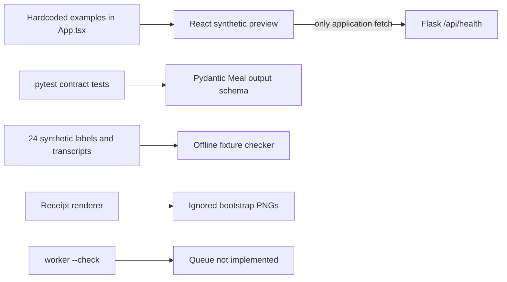
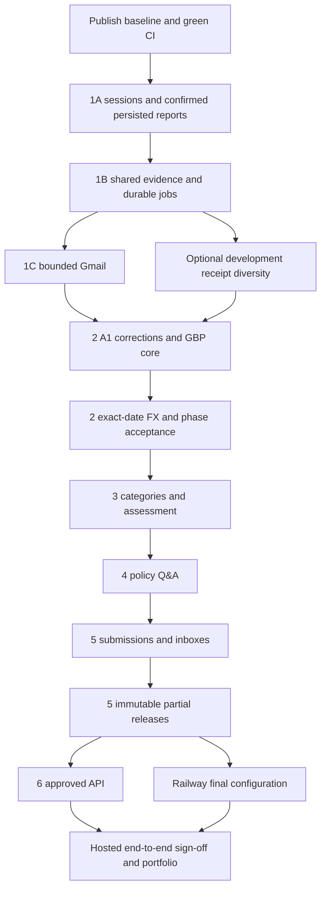

# Unloop — Current state and Codex execution plan

> Historical pre-implementation audit from 7 October. Local FastAPI expense preparation, policy guidance, submission, partial approvals, approved-data API and Arize integration have since been implemented and tested. Use the [current delivery ledger and live backlog](BUILD_STATUS.md) for present status. The dated matrix and audit-only permissions below describe that original audit, not the current task.

Audit date: 7 October 2026 (Europe/London). Repository inspected: `/Users/abhinavbanerjee/projects/vouch`. Configured remote: `https://github.com/abanerjee23/UnLoop.git`. Local branch: `main`, with **no commits and no tracked files** at audit time. The remote advertised **no branches or tags**. This report describes the inspected filesystem, not an identifiable released commit.

## 1. Executive summary

**The current repository is a working Phase 0 scaffold. None of the revised Phase 1–6 end-to-end workflows has been implemented.** This conclusion comes from reading all runtime source, tests, dependencies and configuration, and rerunning the scaffold checks; it does not rely solely on the status text in the build plan.

React displays three hardcoded expected Meal outcomes. Flask serves one application endpoint, `/api/health`. Pydantic implements a useful but incomplete Meal extraction output contract. A fixture checker reconciles 24 synthetic labelled cases. The worker can check its entry point but cannot process work. There is no database adapter, migration, session, report API, upload API, queue, Gmail OAuth/scan adapter, model call, FX adapter, policy service, submission, manager decision or approved-data API.

Fresh verification passed: Ruff, **17 backend tests**, **24 fixture cases**, worker `--check`, TypeScript/Vite build, **2 Playwright tests**, and a real localhost Flask health request. These checks demonstrate the scaffold. Browser tests stub health; fixture checks make **zero model calls**. No provider integration, hosted deployment, extraction quality, product latency, cost or time-saving claim is established.

Keep the planned sequence **1A → 1B → 1C**. First establish server-owned personas, confirmed reports and PostgreSQL persistence; then add shared evidence intake and durable jobs; finally connect Gmail to that proven pipeline. Start with **one implementation task/agent**. Use at most two later, only where contracts and file ownership are settled. **No manual worktree required.**

There is one prerequisite before Cloud implementation: publish the existing tested baseline and this audit to the correct full-version repository, then verify CI. Publication has not happened and is not performed by this audit. The **single best next implementation task** is a complete **Phase 1A session-owned, explicitly confirmed report creation and reopen vertical slice**. A ready-to-paste prompt is in section 13.

### Audit boundaries and stopping rules

**Included:** the complete current `BUILD_PLAN.md`; its governing vision, architecture, A1 contract, synthetic policy, Gmail design, iteration log, delivery workflow and validation records; README/navigation/migration/fixture guidance; every application, worker, helper, test and configuration source file; both fixture manifests and their source transcripts; dependency locks; archive index/manifest and preservation verification; local Git state and read-only remote refs. The supplied AGENTS instructions apply. No repository `AGENTS.md` file was found.

**Excluded:** installed dependency source, caches, exhaustive generated bundle review, archived designs as active requirements, the separate hackathon repository/source plan, external account dashboards, real mailbox contents and production databases. Generated frontend output was rebuilt; the fresh mobile screenshot was inspected. The archive's ten preserved originals were hash-verified, not treated as a second current plan. Google/provider links in the design are reference material; this audit assesses whether adapters exist rather than revalidating provider rules. Official OpenAI Cloud documentation was checked for the execution recommendation.

**Evidence standard:** code plus an appropriate executable check can establish a narrow capability. Documentation, an installed package, placeholder variable, synthetic label, hardcoded amount or stubbed provider response cannot establish a live integration. Absence claims refer to this inspected source inventory. External services could exist elsewhere and remain unverified.

**Allowed audit actions:** read source/history/refs; run existing local checks and small read-only validation probes; regenerate ignored build/test output; write this report. No feature work, application fixes, plan edits, migrations against a service, paid model calls, Gmail authorization/scans, provisioning, commits, pushes, PRs or deployment. Historical publication authorization in documentation does not override the current audit-only request.

**Stop the audit when:** all active source documents and source directories have been covered, every meaningful Phase 0–6 requirement and cross-phase gate has an evidence row, available local checks have been recorded, external unknowns have explicit verification gates, and this report passes preservation/link checks. Do not extend the audit into implementation to resolve a missing integration. If a check needs unavailable access, record UNKNOWN / NEEDS VERIFICATION and the specific next proof; do not search for secrets or substitute mocked success. This is a bounded engineering audit, not a penetration test or a production certification.

### Classification rules

| Status | Meaning in this audit |
|---|---|
| **DONE** | The scoped requirement exists and the available appropriate checks establish it. A DONE scaffold row does not complete its future production counterpart. |
| **PARTIAL** | Executable, reusable implementation satisfies part of the requirement; material gates remain. |
| **SCAFFOLD/MOCK** | Preview, placeholder entry point, test labels or configuration exists without the required workflow/integration. |
| **NOT STARTED** | No implementation of the requirement was found in this repository. Design alone does not change this status. |
| **UNKNOWN / NEEDS VERIFICATION** | The claim concerns external state or proof unavailable in this audit. This does not mask missing adapter code, which is NOT STARTED. |

Statuses are per requirement rather than a percentage. No overall completion percentage would meaningfully represent financial correctness, ownership or live integration readiness.

## 2. Current architecture as actually found



The planned database, agents, integrations and workflow services in `Architecture.md` are **design**, not runtime components in this diagram.

### Evidence register

Matrix rows below refer to these exact files/functions. Each entry states both the observed capability and its limit. `E0` is negative implementation evidence from the complete source inventory, not merely an unsuccessful keyword search.

| Evidence ID | Actual path / component / observation |
|---|---|
| **E0** | Entire active source inventory: six Python modules in `backend/unloop`, three backend test modules, three frontend source files, build/browser/TypeScript configuration, one browser test file, and one helper script. `create_app().url_map` contains Flask's default static rule and `/api/health` only. No business endpoints/services or additional application packages were found. `pyproject.toml`/`uv.lock` have no SQLAlchemy, Alembic, PostgreSQL driver, Agents SDK, Gmail or Galileo integration packages. No Railway/Docker/Procfile deployment configuration exists. |
| **E1** | [backend/unloop/__init__.py](../../backend/unloop/__init__.py): `create_app`, `health`, JSON 404 handler; `MAX_CONTENT_LENGTH = 10 * 1024 * 1024`. Health explicitly returns `phase=scaffold`, `persistence=false`. No report/session/upload handler or React build serving. |
| **E2** | [frontend/src/App.tsx](../../frontend/src/App.tsx): `examples`, `App`, local `selected`/`showReceipt` state, health fetch with abort timeout, static report header and receipt text, disabled upload/save. No chat, persona, persistence or mutation fetch. |
| **E3** | [frontend/src/styles.css](../../frontend/src/styles.css), [main.tsx](../../frontend/src/main.tsx), [index.html](../../frontend/index.html): responsive synthetic workspace, React mount and preview title. Mobile CSS hides the upload button at widths below 700px. |
| **E4** | [backend/unloop/contracts.py](../../backend/unloop/contracts.py): `StrictModel`, `FieldResult.check_support`, `CommonFields.validate_values`, `MealFields.validate_meal`, `ExtractionResult.check_complete`, `validate_context`. Executable Meal schema v0.1; selected numeric/date/enum/reference checks only; no input contract, persistence or model run. |
| **E5** | [backend/unloop/fixture_check.py](../../backend/unloop/fixture_check.py): `load_dataset`, `validate_case`, `check_all`, `LIMITS`. Decimal cap/rate calculations validate expected labels offline. This module is not imported by the Flask app or worker. |
| **E6** | [backend/unloop/worker.py](../../backend/unloop/worker.py): `main` supports `--check`; normal execution exits with code 2 and “Queue processing is not implemented yet.” |
| **E7** | [backend/unloop/doctor.py](../../backend/unloop/doctor.py), [.env.example](../../.env.example): inherited-variable presence only; no `.env` loader or connections. Supabase Auth-era variables remain. Gmail/session/token configuration is absent from this template. |
| **E8** | [pyproject.toml](../../pyproject.toml), [uv.lock](../../uv.lock), [frontend/package.json](../../frontend/package.json), [package-lock.json](../../frontend/package-lock.json), [.python-version](../../.python-version): Flask/Pydantic runtime; pytest/Ruff/Pillow dev tools; React/TypeScript/Vite/Playwright frontend. Python 3.12 selected; frontend requires Node ≥22.12. |
| **E9** | [backend/tests/test_app.py](../../backend/tests/test_app.py): `test_liveness_does_not_claim_provider_readiness`, `test_scaffold_does_not_expose_fixtures_or_writes`. Report GET/POST return 404. [test_contracts.py](../../backend/tests/test_contracts.py): numeric/missing/extra output/reference/revision/category rejection. [test_fixtures.py](../../backend/tests/test_fixtures.py): offline label consistency and explicit VAT evidence. 17 parametrized test cases pass. |
| **E10** | [frontend/tests/preview.spec.ts](../../frontend/tests/preview.spec.ts), [playwright.config.ts](../../frontend/playwright.config.ts), [vite.config.ts](../../frontend/vite.config.ts), [tsconfig.json](../../frontend/tsconfig.json): two tests of static preview, stubbed health success/failure, receipt visibility, disabled save and 390px overflow. Vite dev proxy is `/api` → localhost:5001. No real API workflow browser test. |
| **E11** | [fixtures/meals/README.md](../../fixtures/meals/README.md), [development/cases.json](../../fixtures/meals/development/cases.json), [heldout/cases.json](../../fixtures/meals/heldout/cases.json), their receipt `.txt` files, [scripts/render_receipts.py](../../scripts/render_receipts.py): twelve cases per split, disjoint sources, labels and synthetic FX; uniform PNG rendering available. No real photos or PDF/multipage corpus. |
| **E12** | [backend/migrations/README.md](../../backend/migrations/README.md): guidance only. No Alembic initialization, revision, ORM model or database connection. |
| **E13** | [.github/workflows/checks.yml](../../.github/workflows/checks.yml): push/PR backend lint/tests/fixtures and frontend install/build/browser tests; no DB integration job, deployment or worker check in CI. [.gitignore](../../.gitignore) excludes secrets/dependencies/caches/generated artifacts. |
| **E14** | [Synthetic_T&E_Policy.md](../policy/Synthetic_T&E_Policy.md): draft v0.2, inactive, no effective date; clauses are design inputs, not executed policy. [Receipt_Extraction_Agent.md](../agents/Receipt_Extraction_Agent.md): design v0.2 explicitly identifies schema v0.1 and missing integration gates. |
| **E15** | [GMAIL.md](../integrations/GMAIL.md), [Architecture.md](../../Architecture.md), [Unloop_Vision.md](../../Unloop_Vision.md): agreed ownership/integration/workflow contracts; existing GCP/hackathon assets are asserted reference assets, not exercised here. |
| **E16** | [BUILD_PLAN.md](../../BUILD_PLAN.md), [DELIVERY_WORKFLOW.md](DELIVERY_WORKFLOW.md), [PRODUCT_ITERATION_LOG.md](PRODUCT_ITERATION_LOG.md), [README.md](../../README.md): current phase/order/shipping rules. ITER-003 is still “Validating” with pending publication. [ITER-001_VALIDATION.md](../validation/ITER-001_VALIDATION.md) and [DOCS_UPDATE_VALIDATION.md](../validation/DOCS_UPDATE_VALIDATION.md) retain dated historical evidence. |
| **E17** | Read-only Git checks: `git status --short` shows project files untracked; `git ls-files` empty; `git log` reports no commits; branch `main`; `origin` matches full-version UnLoop; `git ls-remote --heads --tags origin` succeeds with no refs. No commit, PR or Actions result can be inferred. |
| **E18** | Fresh audit checks in section 6; inline Pydantic probes accept non-ISO `ZZZ`, an ambiguous field without references, and a complete result with an unreadable/supporting-only document finding. No source tests or application code were edited to run these probes. |

The full source-of-truth reading covers all 154 lines of the build plan, 123 of the vision, 188 of the architecture, 266 of A1, 223 of policy, 49 of Gmail, 173 of iteration log and 37 of delivery workflow, plus their local validation/navigation/fixture references. Archived login/manual-only/split designs are superseded. No recent Git history exists; documentation dates and archive checksums are historical context only.

## 3. Full Phase 0–6 reconciliation and requirement evidence matrix

IDs map to the phases/sections of `BUILD_PLAN.md`; finer rows split combined requirements where evidence differs. The proof column is the remaining completion evidence, not work performed in this audit. Cross-phase gates follow the phase tables.

### Phase 0 — Foundation

| ID | Requirement | Status | Evidence and remaining proof |
|---|---|---|---|
| 0.01 | Runnable React/TypeScript/Vite frontend | **DONE** | E2/E3/E8/E10/E18: build and browser tests pass for the preview. |
| 0.02 | Flask scaffold and health route | **DONE** | E1/E9/E18: factory/tests and real localhost HTTP 200; health honestly excludes persistence. |
| 0.03 | Checkable worker entry point | **DONE** | E6/E18: `--check` passes. Actual queue is a separate Phase 1 requirement. |
| 0.04 | Initial A1 Meal output schema and context-reference checks | **DONE** | E4/E9: narrow v0.1 schema checks pass. Full v0.2 contract is not complete. |
| 0.05 | 24 labelled synthetic Meals with 12/12 separation | **DONE** | E5/E11/E18: fixture check validates counts, evidence locations, source disjointness and expected arithmetic. |
| 0.06 | Clearly synthetic expected-value preview | **DONE** | E2/E10: visible synthetic boundary, static £62/£50/£12 example, disabled save. Stale sign-in copy needs adaptation. |
| 0.07 | Local tests/validation record and fixture renderer | **DONE** | E9–E11/E16/E18: prior evidence plus fresh checks; renderer exists and historical generated images are bootstrap inputs only. |
| 0.08 | Realistic image/PDF diversity before extraction measurement | **NOT STARTED** | E11: transcript placeholders and uniform generated PNGs cannot represent blur, photos or multipage PDFs. Add independent inputs before Phase 2 quality claims. |
| 0.09 | Existing external GCP/Supabase/service readiness | **UNKNOWN / NEEDS VERIFICATION** | E7/E15: setup is asserted elsewhere; no connectivity proof here. Historical Supabase Auth checklist is superseded, not unfinished login work. |
| 0.10 | Publish tested baseline and obtain hosted CI result | **PARTIAL** | E13/E16/E17: checks/config ready and locally passing; no commit, remote refs or CI result. Finish baseline publication before Cloud feature work. |

**Phase conclusion:** foundation complete within its deliberately limited local scaffold scope. Publication and external setup are not established by “Phase 0 complete.”

### Phase 1 — Sessions, workspace, evidence and Gmail

| ID | Requirement | Status | Evidence and remaining proof |
|---|---|---|---|
| 1A.01 | Server-owned opaque httpOnly session cookie and expiry | **NOT STARTED** | E0/E1/E12: no session table/handler/cookie. Need persisted owner, expiry and rejection of unknown/expired cookies. |
| 1A.02 | Predefined employee/manager profiles and fixed trusted grade | **NOT STARTED** | E0/E12: no profiles or seeds. Grade must be server-owned and unaffected by client/model input. |
| 1A.03 | Ownership and persona authorization on server | **NOT STARTED** | E0/E1/E9: only health/404; no access-controlled objects. Need two-session and role action tests. |
| 1A.04 | Cross-site mutation protection and hosted cookie settings | **NOT STARTED** | E1: no mutation routes or CSRF/origin policy; no session Secure/SameSite configuration. |
| 1A.05 | Top Employee/Manager toggle; no app login/logout | **NOT STARTED** | E2: no toggle or login implementation. Preview says sign-in will arrive; remove that promise during 1A. |
| 1A.06 | Astra chat as report intake; report list/workspace and inbox entry | **SCAFFOLD/MOCK** | E2/E3: static example report layout only. No chat/list/inbox. 1A needs live report shell and honest empty manager inbox entry; transactional inbox events arrive in Phase 5. |
| 1A.07 | Propose report name, explicit date range/year and purpose | **NOT STARTED** | E2: fixed header lacks date range/intake. Need bounded parsing/clarification; no manager-email input. |
| 1A.08 | Validate and explicitly confirm header before report creation | **NOT STARTED** | E1/E2/E9: report POST is 404. Require validated confirmation, safe duplicate submission behaviour and unambiguous dates. |
| 1A.09 | PostgreSQL adapter, SQLAlchemy/Alembic and initial migrations | **NOT STARTED** | E8/E12: dependencies and executable migrations absent. Use sessions/profiles/reports/header revisions first. |
| 1A.10 | Save/list/reopen within session; manager cannot see drafts | **NOT STARTED** | E2: only volatile selection state; E1: no reads/writes. Need actual PostgreSQL reload and app-process restart proof plus isolation. |
| 1A.11 | Actual Supabase PostgreSQL connectivity | **UNKNOWN / NEEDS VERIFICATION** | E7: inherited `DATABASE_URL` absent; no connection attempted. An external database may exist. Need securely configured test DB and Supabase smoke. |
| 1B.01 | JPEG/PNG/PDF upload from chat and workspace via one pipeline | **SCAFFOLD/MOCK** | E2: disabled upload button; E1: no endpoint. Need both locations to use the same server ingestion service. |
| 1B.02 | Signature/MIME/size/page/batch validation | **PARTIAL** | E1: only whole-request 10 MiB ceiling. No file/page/type validation. Candidate limits: 10 MiB/file, ten pages/file, ten files/batch; reconcile envelope overhead and request cap. |
| 1B.03 | Store original bytes in PostgreSQL separately from list rows | **NOT STARTED** | E0/E12: no document metadata/blob/evidence schema or retrieval endpoint. No object-store integration should be added. |
| 1B.04 | Evidence links, provenance and session-private document access | **NOT STARTED** | E4 has output reference structures only; E0/E12 lack persistent document association and authorization. |
| 1B.05 | Owner-scoped hashing/deduplication without cross-owner disclosure | **NOT STARTED** | E11 has a duplicate label; no runtime hashing, uniqueness constraint or repeated-upload handling. |
| 1B.06 | Expense revision/evidence/job migrations introduced when needed | **NOT STARTED** | E12: guidance only. Add real tables during 1B; do not create all Phase 6 entities in 1A. |
| 1B.07 | Durable PostgreSQL queue, attempts, leases and timeout recovery | **SCAFFOLD/MOCK** | E6: check-only worker, normal execution refuses work. Need transactional enqueue/claim, expired lease recovery and bounded backoff. |
| 1B.08 | Revision checks and idempotent result writes | **PARTIAL** | E4 `validate_context` compares supplied job/revision IDs. It does not query current revision, reject a superseded persisted job or write anything. |
| 1B.09 | UI polling, visible failures/partial progress and retry | **NOT STARTED** | E2 fetches health only. Need owner-scoped job API, polling and interrupted-job recovery UI. |
| 1B.10 | Retry without duplicate evidence/candidates/inbox events | **NOT STARTED** | E0/E6/E12: no transactional results or dedup keys. Inbox-specific production behaviour is extended in Phase 5. |
| 1C.01 | Reuse existing GCP application/demo mailbox | **UNKNOWN / NEEDS VERIFICATION** | E15 asserts existing setup for `aban.hackathon@gmail.com`; not inspected or exercised here. Verify it during authorized integration. |
| 1C.02 | Python OAuth exchange and exact local/Railway callbacks | **NOT STARTED** | E0/E7/E8: no Google adapter/routes/dependencies or callback config. Separate hackathon callback is not reusable proof. |
| 1C.03 | Single-use expiring state bound to owner | **NOT STARTED** | E0/E12: no OAuth state entity or replay/owner protection. |
| 1C.04 | Server-only secrets; encrypted access/refresh tokens and lifecycle | **NOT STARTED** | E7/E12: no encryption/token connection/refresh/disconnect/expiry cleanup implementation. |
| 1C.05 | Connected account display and consent separate from persona/login | **NOT STARTED** | E2: no connection state. Manager must never gain mailbox authority through toggle. |
| 1C.06 | Explicit bounded consent per report scan; disclose window/lookback | **NOT STARTED** | E15 is design only. Need durable scan authorization tied to report revision, expiry and one operation. |
| 1C.07 | Candidate metadata/attachment retrieval, bytes and provenance | **NOT STARTED** | E0: no Gmail API client/import code. Need actual permitted attachment bytes and mailbox/message/attachment/timestamp/hash record. |
| 1C.08 | Shared upload validation/dedup pipeline; ambiguous dates reviewed | **NOT STARTED** | E0/E12: neither shared intake nor Gmail adapter exists. No source-specific eligibility shortcut. |
| 1C.09 | Denied/wrong-account/revoked/empty/partial/quota failure recovery | **NOT STARTED** | E0/E2: no connection/scan states or corresponding UI/tests. Retain completed imports during bounded retry. |
| 1C.10 | Scan limits, truncation, no continuous monitoring | **NOT STARTED** | E15 defines candidate bounds, not enforcement: ≤31-day report, 90-day lookback/7-day extension, 15 messages, ten files, 40 MiB aggregate. No scan loop exists. |
| 1C.11 | Disconnect/revocation, key rotation, token/evidence retention | **NOT STARTED** | E0/E12/E15: no lifecycle code. Token deletion and retained-evidence deletion need separate explicit semantics. |
| 1C.12 | Demonstrate live Gmail retrieval and saved state/isolation | **UNKNOWN / NEEDS VERIFICATION** | No live Gmail run or approved test credentials examined. Adapter is independently NOT STARTED. Mocked bytes cannot close this gate. |
| 1.PM | Evidence-sourcing actions, connection friction and recoverable journey | **NOT STARTED** | E16 has no measured Phase 1 run. Record actual journey/failures after 1B/1C, not from screenshot/variable presence. |

### Phase 2 — First complete Meal flow

| ID | Requirement | Status | Evidence and remaining proof |
|---|---|---|---|
| 2.01 | Real A1 through OpenAI Agents SDK; pinned available API model | **NOT STARTED** | E8: SDK absent; E0: no call/agent/prompt. Verify real API identifier; “Luna” alone is not one. |
| 2.02 | Authorized minimal input bundle and full input/locked-field schema | **NOT STARTED** | E4 implements output only. Need validated input and document permissions; exclude headers/grade/mailbox secrets from A1. |
| 2.03 | Structured output validation: date/money/enums/required fields | **PARTIAL** | E4/E9: strict extra fields, finite positive receipt amounts, VAT ≤ total, ISO-format dates and Meal enums. Currency membership, full role/readability and human precedence remain absent. |
| 2.04 | Exact job/revision and document/page reference validation | **PARTIAL** | E4 `validate_context`/E9 reject supplied mismatches and outside refs. No current DB revision check, factual snippet verification, complete document coverage or authorization lookup. |
| 2.05 | Store AI suggestions/provenance at current expense revision | **NOT STARTED** | E12: no expense/revision/run/provenance tables or writes. |
| 2.06 | Preserve human corrections/category overrides on rerun | **NOT STARTED** | E2 has no edits; E4 has no lockedHumanFields/categoryOverride input or merge service. |
| 2.07 | Missing VAT blank/non-blocking | **PARTIAL** | E4/E9 accept a complete Meal with `vatAmount=notFound`; no editable persisted record or runtime intake. |
| 2.08 | Honest unreadable/missing/unsupported category states | **PARTIAL** | E4 supports state enums and forces Air/GT unsupported; E18 accepts unreadable finding with complete output. UI has only a hardcoded missing-Meal example. |
| 2.09 | Targeted chat question automatically opens expense/fields/receipt | **SCAFFOLD/MOCK** | E2 shows a static question after manual example selection, not chat issue routing or automatic opening. |
| 2.10 | Revisitable Open expense action and usable narrow-screen context | **SCAFFOLD/MOCK** | E3/E10 prove preview responsiveness; no question/expense deep reference or narrow-screen clarification flow. |
| 2.11 | Corrections create revisions and invalidate only dependencies | **NOT STARTED** | E0/E12: no correction service, revision graph or saved checks. |
| 2.12 | No correction training/memory/automatic eval ingestion | **DONE** | E0: no correction collection or learning path exists. Preserve this boundary when revisions are implemented; audit inspection is not prompt tuning. |
| 2.13 | Galileo traces from first real run; minimized, business-independent | **SCAFFOLD/MOCK** | E7 has two variables only; E8/E0 no Galileo code. Need versions/outcome/latency/tokens/cost and outage behaviour. |
| 2.14 | Decimal GBP calculations and £15/£25/£50 Meal caps | **SCAFFOLD/MOCK** | E5 computes expected labels; E2 contains hardcoded outcomes. Neither is an authoritative production calculation service. |
| 2.15 | Preserve full total incl. tip/service; separate receipt/claim/excess | **SCAFFOLD/MOCK** | E2/E5/E11 illustrate this correctly. Need persisted original/full GBP/claim/excess and clause/version, not copied labels. |
| 2.16 | One employee/date/type Meal across session reports/history | **NOT STARTED** | E11 labels multiple receipts/duplicates; no runtime slot reservation, cross-report query or concurrency control. Extend submitted/approved handling in Phase 5. |
| 2.17 | Employee chooses conflicting receipt; never pool allowances | **NOT STARTED** | E2 has explanatory copy only. Need conflict selection/exclusion, exact duplicate reuse and claim-slot release. |
| 2.18 | Saved acceptable historical FX observation reuse | **NOT STARTED** | E12 lacks FX records; E5 consumes synthetic fixture rates only. |
| 2.19 | Frankfurter pinned to ECB primary adapter | **NOT STARTED** | E0/E8: no requests/provider adapter. Need exact requested/returned date and provenance validation. |
| 2.20 | Open Exchange Rates fallback with consistent same-date basis | **NOT STARTED** | E7 variable only. Need authenticated adapter, same-snapshot cross-rate and saved fallback reason/basis. |
| 2.21 | GBP-native no provider call; wrong-date/weekend/unpublished pending | **SCAFFOLD/MOCK** | E5 handles GBP and label consistency; pending cases are labels. Need runtime provider-date rejection and pending transitions. |
| 2.22 | Live primary and fallback FX demonstrations | **UNKNOWN / NEEDS VERIFICATION** | No real provider calls performed; adapter code is NOT STARTED. Verify actual provider access/accepted date coverage when built. |
| 2.23 | Persist locks/facts/FX/policy/calculation revision; reopen without calls | **NOT STARTED** | E0/E12: no records or saved expense reads. Need authoritative reload and selective recomputation proof. |
| 2.24 | Policy activation date, Decimal rounding, runtime budgets and limits | **NOT STARTED** | E14 inactive policy; E5 deliberately avoids rounding-dependent fixtures. Owner decisions required before authoritative assessment/paid bulk experiments. |
| 2.25 | Baseline, held-out real extraction and categorized failure results | **SCAFFOLD/MOCK** | E11/E16: labels and fixture integrity only, zero model runs. Add representative inputs and isolated scorer/run metadata. |
| 2.GATE | Saved £62 Dinner → £50 claim/£12 excess; correction, FX, uncertainty | **SCAFFOLD/MOCK** | E2/E10 prove display values only. No live receipt-to-saved-claim path or reopen exists. |

### Phase 3 — Category coverage and assessment

| ID | Requirement | Status | Evidence and remaining proof |
|---|---|---|---|
| 3.01 | Review Ground Transport eligibility/caps/charge clauses first | **NOT STARTED** | E14 explicitly lacks GT rules. No-cap behaviour is unapproved; keep assessment unavailable until owner review. |
| 3.02 | Air One-way/Return extraction and UI | **NOT STARTED** | E4 deliberately requires Air `unsupported`; no Air fields/service/UI. |
| 3.03 | Public transport/Taxi extraction; optional route absence non-blocking | **NOT STARTED** | E4 has taxonomy string but no GT output fields or processing; E2 Meals only. |
| 3.04 | Canonical cabin and airport/city normalization fixtures | **NOT STARTED** | E11 contains only Meals. Mapping decisions and coverage required. |
| 3.05 | Seeded grade maximum table in deterministic code | **NOT STARTED** | E14 AIR-02–05 defines it; E0 has no profiles/cabin rule. Missing grade must pause; evidence-supported lower cabin allowed. |
| 3.06 | Unsupported cabin/self-declaration cannot pass | **NOT STARTED** | E0/E4: no Air evidence acceptance or cabin rule. Manager must not waive grade/cabin rules. |
| 3.07 | Category correction disables stale fields/revises/rechecks | **NOT STARTED** | E3 static “Not applicable” display only; no category edits/revisions. |
| 3.08 | Approved source registry, immutable policy versions/applicability | **NOT STARTED** | E14 draft file and clause labels only; E12 no runtime registry/activation/version schema. |
| 3.09 | Required-rule checklist and valid clause coverage | **NOT STARTED** | E0: no checklist/assessment/citation validator. Missing retrieval restriction must not grant permission. |
| 3.10 | A2 bounded explanation of validated deterministic findings | **NOT STARTED** | E0/E8: no A2/model call. Cannot change amount/facts, waive policy or approve. |
| 3.11 | Separate missing facts/violation/coverage/technical failure/ambiguity | **SCAFFOLD/MOCK** | E4 issue enums/E2 missing Meal example are partial representations; no assessment/workflow state machine. |
| 3.12 | Genuine ambiguity creates labelled simulated T&E inbox item | **NOT STARTED** | E0/E2/E12: no inbox or referral. Missing evidence/technical failure must not be misrouted. |
| 3.GATE | Mixed reports, category changes, multi-doc evidence, uniqueness, clauses | **NOT STARTED** | E9–E11 test Meal schema/labels only. Need integrated category/policy/access fixtures and unresolved-check blockers. |

### Phase 4 — In-context policy Q&A

| ID | Requirement | Status | Evidence and remaining proof |
|---|---|---|---|
| 4.01 | Reviewed policy/FAQ snapshots, source identity/version/precedence | **PARTIAL** | E14 has stable clauses and draft precedence; no approved active source registry or FAQ snapshots. |
| 4.02 | Clause-aware ingestion and PostgreSQL pgvector retrieval | **NOT STARTED** | E0/E8/E12: no chunks/index/vector integration or migrations. |
| 4.03 | Pinned small embedding baseline aligned with source/index activation | **NOT STARTED** | E0: no embedder/config/index. Exact available embedding identifier still to verify. |
| 4.04 | Access/version/applicability filters and clause/term lookup | **NOT STARTED** | E0: no retrieval service. Filters must apply before model context is built. |
| 4.05 | A3 general/expense-linked questions sharing policy access with A2 | **NOT STARTED** | E0/E2: no Q&A/chat endpoint or agent. Manager context limited to submitted snapshots. |
| 4.06 | Answers/passages/version and validated references beside report | **SCAFFOLD/MOCK** | E2 hardcodes Meal clause names; no retrieved text, answer sources or citation validation. |
| 4.07 | Referenced expense opening; automatic Astra clarification opening | **NOT STARTED** | E2 example selection is not source-linked navigation. |
| 4.08 | Preserve A2 core/checklist so top-k cannot omit restriction | **NOT STARTED** | E0: no A2 or retrieval. Required context must be explicit in its future contract. |
| 4.09 | Held-out RAG vs full-policy baseline across adversarial/source cases | **NOT STARTED** | E11 Meals only; no Q&A dataset/runs or source-malicious/outdated/conflicting evals. |
| 4.GATE | ≥90% supported answer/citation quality, zero critical false permission | **NOT STARTED** | No model/retrieval runs or scored answers. Need numerators/denominators and frozen gates. |
| 4.FAIL | Retrieval outage gives recoverable guidance unavailable; no mutations | **NOT STARTED** | E0: no guidance service/recovery. Q&A must never edit facts, compliance, submission or approval. |

### Phase 5 — Submission, inboxes and manager workflow

| ID | Requirement | Status | Evidence and remaining proof |
|---|---|---|---|
| 5.01 | Explicit employee submit and server eligibility gate | **NOT STARTED** | E0/E2: no submission route/button/workflow. Chat acknowledgement must not submit. |
| 5.02 | Eligible-subset preview versus wait; unresolved drafts private | **NOT STARTED** | E0/E12: no line eligibility/selected snapshot. |
| 5.03 | Versioned submitted line/header set; manager sees snapshots only | **NOT STARTED** | E12: no submissions or revision model. Current example is not a stored draft. |
| 5.04 | Transactional submission + both inbox events, same version/amount | **NOT STARTED** | E0/E12: no inbox/event transaction/idempotency. |
| 5.05 | Line-specific manager questions and employee responses | **NOT STARTED** | E0/E2: no conversations/questions/manager UI. |
| 5.06 | Corrections/rechecks/material resubmission before approval | **NOT STARTED** | E0/E12: no working/submitted revision separation. |
| 5.07 | Approve-all or selective release with explicit line/amount preview | **NOT STARTED** | E0: no manager release endpoint or selection UI. |
| 5.08 | Approve eligible subset without employee-created `-1` report | **NOT STARTED** | Neither older linked-split implementation nor new release workflow exists. Keep new design; do not implement obsolete split prerequisite. |
| 5.09 | Distinct held/returned states and next actions | **NOT STARTED** | E0: no decision states. Exact labels/details are a Phase 5 product decision. |
| 5.10 | Immutable approval releases, stable expenses and claimed portions | **NOT STARTED** | E12: no releases/approved lines. Need database-enforced immutability/uniqueness and stable IDs. |
| 5.11 | Idempotency/stale/concurrent approval protections | **NOT STARTED** | E4's in-memory extraction ID check is unrelated to approval. Need transactional version/uniqueness enforcement and concurrent tests. |
| 5.12 | Approved facts cannot change; hidden draft corrections remain private | **NOT STARTED** | E0/E12: no approval snapshot or manager read path. |
| 5.13 | Partially approved remains open with separate approved/pending totals | **NOT STARTED** | E2 only static receipt/claim figures; no report aggregate/lifecycle. |
| 5.14 | Processing-ready/inbox records exactly once per release | **NOT STARTED** | E0/E12: no downstream records. Readiness must not be labelled payment completion. |
| 5.15 | Close only when terminal lines and no active questions | **NOT STARTED** | E0: no report state machine. |
| 5.16 | A4 drafts questions/context with no sending authority | **NOT STARTED** | E0/E8: no A4. Deterministic templates can precede it. |
| 5.17 | Optional Teams configured participants + human review/send/resolution | **NOT STARTED** | E0/E7: no Teams config/launch/context/UI. Do not add manager details back to intake. |
| 5.18 | Teams unavailable: usable in-app/copyable fallback | **NOT STARTED** | E0/E2: no questions/context. Fallback alone cannot prove actual launch. |
| 5.19 | Real Teams launch if claimed in hosted feature | **UNKNOWN / NEEDS VERIFICATION** | Optional feature not built or exercised; may be deferred with explicit feature disclosure. |
| 5.GATE | Ten lines → approve nine → correct/resubmit/release tenth | **NOT STARTED** | No corresponding backend/browser/concurrency tests or real workflow. Inboxes must agree on exact releases and pending work. |

### Phase 6 — Approved API, Railway and portfolio evidence

| ID | Requirement | Status | Evidence and remaining proof |
|---|---|---|---|
| 6.01 | Read-only approved-release API with stable IDs/revisions | **NOT STARTED** | E1 exposes health only. Depends on immutable Phase 5 release schema. |
| 6.02 | Partial reports expose approved subset/total; later separate snapshot | **NOT STARTED** | E0/E12: no releases/API. Repeated reads need stable deduplication semantics. |
| 6.03 | API excludes pending/files/tokens/provenance/explanations/history | **NOT STARTED** | E0: no approved DTO/serializer or allow-list tests. |
| 6.04 | Independent downstream server access credentials | **NOT STARTED** | E7/E1: no API credential validation/config; persona toggle cannot substitute. |
| 6.05 | Railway web serves built React with production Flask process | **NOT STARTED** | E1/E10: only Vite development server/proxy; Flask has no SPA/build handler or production launch setup. |
| 6.06 | Separate Railway worker sharing code and Supabase PostgreSQL | **SCAFFOLD/MOCK** | E6/E12: entry point and migration guidance only. No functioning worker/deploy config. |
| 6.07 | HTTPS callbacks, secrets, migrations, diagnostics and recovery | **NOT STARTED** | E7/E13: no Railway/OAuth/migration startup config. Health is liveness only, not DB/worker readiness. |
| 6.08 | Actual Railway services/account/deployment existence | **UNKNOWN / NEEDS VERIFICATION** | No dashboard/live deployment checked. Separate hackathon deployment is not this application's evidence. |
| 6.09 | Hosted uploads/Gmail/extraction/both FX/Q&A/submit/partial/API | **NOT STARTED** | E0: all live business components missing. Need a hosted authorized journey, not just successful build/push. |
| 6.10 | Hosted isolation/refresh/revocation/stale jobs/source versions | **NOT STARTED** | E9/E10 lack these scenarios; no hosted session/integration evidence. |
| 6.11 | Final held-out regression, quality/cost/latency and manual time comparison | **NOT STARTED** | E11/E16: integrity and historical recollection only; no matched product runs/sample sizes/failed attempts. |
| 6.12 | Baseline → deliberate change → measured result portfolio iteration | **PARTIAL** | E16 records real scaffold/fixture fixes and design reconciliation. No measured live product/model/workflow improvement yet. |
| 6.13 | Run instructions and case study disclosing limitations | **PARTIAL** | E16 README accurately runs scaffold; no full hosted instructions or completed portfolio case study. |
| 6.GATE | Reviewer completes recoverable hosted journey; blockers disclosed | **NOT STARTED** | Current localhost preview cannot meet this. No remaining critical gate may be hidden behind synthetic outcomes. |

### Cross-phase acceptance, safety and operations matrix

These rows reconcile build-plan sections 1, 8–10 and applicable source-document controls. They do not add new product scope.

| ID | Requirement / release gate | Status | Evidence and remaining proof |
|---|---|---|---|
| X.01 | Build → validate → improve; hypothesis/results/decision record | **PARTIAL** | E16 ITER-001/002 exist, ITER-003 pending. Maintain one bounded increment at a time; audit does not rewrite them. |
| X.02 | Build → test → commit → push → check CI → repeat | **PARTIAL** | E13/E17: configuration and local checks, no publication/history/CI run. Railway is a separate shipping gate. |
| X.03 | All deterministic money/caps/totals/access/version/duplicate cases pass | **SCAFFOLD/MOCK** | E9/E11 cover contract/fixture subset only; no persisted access, monetary workflow or concurrency acceptance suite. |
| X.04 | Zero silently wrong critical amount/currency/date on held-out release set | **NOT STARTED** | Zero model runs; E18 shows schema acceptance cannot be treated as extraction correctness. |
| X.05 | ≥95% required-field exact/normalized match with numerator/denominator | **NOT STARTED** | No actual predicted fields or scorer results. |
| X.06 | All missing/unreadable/ambiguous pause; ≥90% complete readable reviewable | **SCAFFOLD/MOCK** | Expected labels only. Need actual outputs and user-reentry/workflow measurement. |
| X.07 | ≥90% policy answer/citation correctness; zero critical false permission | **NOT STARTED** | No A2/A3/retrieval/dataset. |
| X.08 | ≥30% active preparation time reduction on matched supported tasks | **NOT STARTED** | Recalled Concur timing includes out-of-scope accommodation; not a baseline comparison. Include sample size/failures and waiting separately. |
| X.09 | p95 <30s receipt and <15s policy answer, local/hosted separated | **NOT STARTED** | Test-suite durations and health latency are not product latency. |
| X.10 | Per-receipt/question/report cost; budget after baseline before bulk | **NOT STARTED** | No paid calls/token records or budgets. |
| X.11 | Freeze gates before tuning; development vs held-out separation | **PARTIAL** | E11 disjoint sources and guidance; targets proposed, no frozen live eval/run plan. Audit read labels for inspection, not tuning; future tuning exposure must be logged/replenished. |
| X.12 | Missing VAT/tips/caps/contradictions/duplicates/foreign/wrong-date/injection cases | **SCAFFOLD/MOCK** | E11 labels cover several cases, including receipt injection; no live model/security/revision/integration regression. |
| X.13 | Gmail consent/failure/partial import and cross-session acceptance cases | **NOT STARTED** | E9/E10 have none. |
| X.14 | Locked human/category corrections; stale jobs; concurrent approvals/history | **NOT STARTED** | E9 checks supplied extraction IDs only; no persistence/concurrency tests. |
| X.15 | Stronger model only after diagnosed measured gain; no automatic upgrade | **NOT STARTED** | No model selection/runtime/experiment exists. Preserve design baseline until actual identifier verified. |
| X.16 | Receipt/user/policy text cannot grant roles/writes/network authority | **PARTIAL** | E4 rejects extra financial outputs; no agent tools or workflow writes exist. Full evidence injection, authorized context and boundary tests still required. |
| X.17 | Server-only credentials, minimized/redacted diagnostic payloads | **PARTIAL** | E7 blank template and presence-only doctor; no credential-bearing provider integration or redaction pipeline. No real-data integration claim. |
| X.18 | Document/token retention/deletion and backup/restore before real-data claims | **NOT STARTED** | E15 requests lifecycle/ops rules; no implementation or restoration exercise. |
| X.19 | At-least-once jobs; bounded calls/retries/turns/concurrency/spend | **NOT STARTED** | E6 has no processing. External calls may repeat after crash; idempotent DB effects must not imply exactly-once provider execution. |
| X.20 | Operational provider outages separated from policy decisions | **NOT STARTED** | E2 health offline copy only; no model/FX/Galileo/retrieval/token recovery. |
| X.21 | Original files fetched on demand; list rows exclude large bytes | **NOT STARTED** | No database/evidence API; static receipt text only. |
| X.22 | Explicit excluded scope remains excluded | **DONE** | E0 shows no learning, accommodation processing, mailbox monitoring, Teams reading/sending, notifications, real specialist/payment/ERP, policy overrides or production multi-user implementation. Do not build them incidentally. |
| X.23 | Public Gmail/production owner-role readiness is not demo completion | **UNKNOWN / NEEDS VERIFICATION** | E15 explicitly defers it; audience/verification/account-policy decisions have not been examined. Not a reason to replace the agreed demo toggle. |

## 4. Detailed Phase 1A / 1B / 1C status and gates

### 1A — Persona sessions, confirmed reports, PostgreSQL

**Current status: NOT STARTED as a working increment.** The static report shell is reusable visual scaffolding, but it contains no report model or API. A1 output identifiers are not session/report persistence.

Implement the whole thin vertical slice in one task: initial migrations/adapter, server session/profile/grade, persona/access/CSRF rules, bounded Astra report intake, explicit header confirmation, report list and reopen. Manager mode should have an honest empty review/inbox shell and no draft access. Do not build full Phase 5 events/approvals just to populate it.

Prefer deterministic intake and targeted questions for name, purpose and explicit ISO date range/year. Unsupported natural-language formats can request clarification. A model parser is not required to deliver this user value, and would add provider/cost dependencies before the ownership foundation exists. Validate the confirmed header again server-side; a client-displayed proposal is not authority.

**Close 1A only after:** a fresh PostgreSQL migration; report creation occurs only after confirmation; valid and ambiguous date cases work; saved data survives reload and backend restart; a second session cannot list/read/mutate it; manager cannot create/read unsubmitted reports; grade cannot be client-edited; missing/expired session and cross-site mutations fail safely. A PostgreSQL service in CI proves engine semantics; separately record a Supabase PostgreSQL connection/reopen smoke. SQLite and localStorage do not close this gate.

Resolve and document settings here: session TTL, fixed demo grade, cookie mode, CSRF mechanism, header validation bounds, explicit date semantics and safe retry/idempotency of confirmation. These are bounded implementation choices; do not reopen the agreed no-login/no-manager-field direction.

### 1B — Uploads, evidence, durable jobs

**Current status: SCAFFOLD/MOCK overall.** The disabled upload button, 10 MiB request ceiling and worker entry point do not accept or retain a document.

After 1A is merged, add metadata/blob/provenance/evidence/revision/job tables and one ingestion service. Chat/workspace send to the same endpoint. Enforce signature/MIME/size/page/batch checks, owner-scoped content hashing and authorized original-byte reads. Store evidence and enqueue transactionally. Lists must not select original bytes.

Make the worker genuinely durable before introducing paid extraction. An evidence-validation/preparation job can produce real retained processing state without pretending to have extracted a Meal. Reserve actual A1 inference for Phase 2. Claim/lease/attempt/backoff/result contracts should support later model and Gmail jobs; do not manufacture expense values to make 1B appear complete.

**Close 1B only after:** upload and reopen real synthetic JPEG/PNG/PDF bytes from both UI locations; reject spoofed/oversized/excess-page/batch input; isolate owners; replay imports without duplicate docs/candidates; kill/restart worker and recover expired lease; reject stale writes; expose accurate queued/processing/failed/retained evidence states. Candidate limits need validation against representative examples. Decide whether a batch uses one multipart request or individual requests before adjusting Flask's request cap.

### 1C — Consent-based Gmail

**Current status: NOT STARTED; existing external setup UNKNOWN / NEEDS VERIFICATION.** There is no import implementation to port or repair inside this repository. The other app is reference material only.

Start after 1B's document and job contracts have passed recovery tests. Reuse the existing Google application, but implement Python callbacks/exchange, session-bound state, encryption and refresh/disconnect. Explicit report scan permission is separate from connection and binds to one report revision/window. Show account, disclosed search window and incomplete/truncated results. Retrieve only bounded candidate attachment data; call the shared intake service, not a second storage/validation path.

**Close 1C only after:** actual consent and attachment bytes for the dedicated demo mailbox; replay/owner/state tests; denied/wrong-account/revoked/expired/empty/partial/interrupted scans; idempotent retry; manager exclusion from credentials; token cleanup/disconnect and retained-evidence explanation. Railway's exact HTTPS callback is a separate hosted verification, required by Phase 6 and earlier if Gmail is deployed for feedback. Public arbitrary-user onboarding remains excluded.

**Sequence verdict:** unchanged. Gmail depends on the session owner/report revision and the evidence queue. Uploads depend on ownership/persistence. Reversing these would create duplicate pipelines or insecure temporary state. Do not parallelize full 1A and 1B, or full 1B and 1C, in today's repository.

## 5. Architectural conflicts and disposition

| Conflict / tension | Decision | Reason and when to act |
|---|---|---|
| Preview promises future “sign-in” despite no app-login design | **ADAPT** | `App.tsx` preview notice is stale. Update in 1A to accurate persona/session/intake copy. No auth feature needs removal because none exists. |
| Static `manager@example.com` shown in report header | **REMOVE LATER** | Remove from the live creation/header experience in 1A. Use predefined routing; optional Teams config is separate. It is display-only today. |
| `.env.example`/`doctor.SERVICES` require Supabase URL/publishable key/Auth-era wording | **ADAPT** | Keep server PostgreSQL configuration and phase-specific provider settings; remove misleading login/client-auth requirements when 1A config is implemented. Add actual session/Gmail settings in their increments. |
| Existing whole-request 10 MiB cap versus 10 MiB/file and ten-file batch | **ADAPT** | Multipart overhead alone can reject a nominal maximum file; a full batch can exceed request cap. Define transfer strategy/envelope limits in 1B and verify both layers. |
| Worker normal execution always exits; check says ready | **REPLACE** | Keep module/CLI entry point, replace stub body with leased DB jobs in 1B. `--check` is no worker health proof. |
| Static example report cannot act as Astra-first workspace | **ADAPT** | Reuse evidence/amount visual patterns; introduce components/state around real report API. No need to discard React/Vite or redesign every screen. |
| Mobile CSS hides upload control | **ADAPT** | Useful 1A/1B flows need available upload in narrow-screen chat/workspace and later return-to-question context. Current overflow test does not verify discoverability. |
| Fixture cap/FX arithmetic might be mistaken for production rules | **KEEP** | Retain as independent label consistency logic. Implement production calculation service/tests in Phase 2; never import expected labels as runtime facts. |
| Meal v0.1 schema versus richer v0.2 A1 contract | **ADAPT** | Retain strict/Decimal/reference foundations. Add input locks, ISO currency set, document-role/readability and persisted stale-revision gates before real A1 acceptance. Extend Air/GT in Phase 3, not all at once. |
| Ground Transport strings exist but execution rejects it | **KEEP** | Deliberate Meals-first support boundary. Enum presence is not category coverage and should stay unsupported until Phase 3. |
| Draft policy clauses displayed with compliant/capped static examples | **KEEP** | Safe as explicitly synthetic expected outcomes. Live claims must use owner-approved active policy with effective date; do not activate draft from preview text. |
| Policy effective date/version applicability and GBP rounding unresolved | **NEEDS PRODUCT DECISION** | Owner must approve before authoritative Phase 2 calculation; use Decimal and test approved convention. Exact-date FX remains current rule. |
| Ground Transport caps/charges and branded cabin mappings unresolved | **NEEDS PRODUCT DECISION** | Review before Phase 3. Missing coverage cannot become no-cap permission. |
| Claimed “Luna” baseline without exact model identifier | **NEEDS PRODUCT DECISION** | Verify available API ID during Phase 2 and record quality/cost rationale; do not silently pick an upgrade. |
| General preferred promptfoo/Langfuse/Phoenix versus specific Galileo design | **KEEP** | Existing project docs explicitly retain Galileo. Do not introduce a tooling migration in 1A or a duplicate trace pipeline. A desired switch needs a separate scoped decision. |
| Railway chosen despite general Railway/Vercel preference | **KEEP** | Project-specific Flask + worker + PostgreSQL architecture fits Railway choice. No Vercel migration is required. |
| Planned one PostgreSQL store versus temptation to add object storage/vector DB | **KEEP** | No storage implementation currently conflicts. Bytes and pgvector remain in PostgreSQL; avoid new infrastructure. |
| Archived login/manual-only/employee-led split design | **KEEP** | Keep frozen historical files with labels; exclude from active implementation. There is no runtime old Auth/split code to replace. |
| Older validation says no remote; current configured remote has no refs | **KEEP** | Dated evidence is accurate historical context. New audit records actual remote/publication status without rewriting history. |
| Plan says delivery authorized; current user requests inspection only | **KEEP** | Preserve future delivery workflow but do not commit/push/implement during this task. Publication remains a recommended prerequisite. |
| Session TTL/token and evidence retention, backup/restore choices open | **NEEDS PRODUCT DECISION** | Document bounded demo defaults in 1A; settle evidence lifecycle before Gmail/real-data claims. Never leave reusable orphan Gmail tokens after expiry. |
| Held/returned labels and approved release DTO unresolved | **NEEDS PRODUCT DECISION** | Set in Phase 5 before release/API implementation. Preserve stable IDs and submitted/approved immutability. |
| Separate hackathon Gmail/hosting code exists by documentation claim | **KEEP** | Reuse knowledge/config only during authorized integration. Do not modify, migrate or count it as implemented full-version code. |

No rewrite or framework replacement is warranted. Most conflicts are stale preview/setup aids and missing detailed gates, rather than an incompatible working system.

## 6. Test and validation status

### Fresh checks run during this audit

| Check | Observed result | Interpretation |
|---|---|---|
| `uv run --frozen ruff check backend scripts` | Pass | Existing Python source lint. |
| `uv run --frozen pytest -q` | **17 passed**, 0.21s | Health, Meal schema/context and fixture tests; no DB/provider/workflow tests. |
| `uv run --frozen python -m unloop.fixture_check` | **24 cases**, 12/12 split, `modelRuns: 0` | Expected-value/source integrity, not extraction quality. |
| `uv run --frozen python -m unloop.worker --check` | Pass, explicitly says queue not configured | Module entry point only. |
| `npm run build --prefix frontend` | Pass, TypeScript check and Vite build, 29 modules | Produces static bundle; no hosted integration. |
| `npm test --prefix frontend` | **2 passed**, 6.3s | Health stub/static values/evidence toggle/disabled save/mobile overflow only. |
| Real HTTP health smoke | 200 from an ephemeral localhost Werkzeug server | `service=unloop`, `status=ok`, `phase=scaffold`, `persistence=false`; server shut down after request. |
| Mobile screenshot | Fresh 390px preview visually inspected | Readable static receipt/claim layout; does not prove mobile chat, upload or navigation. |
| Archive manifest | All ten originals match SHA256 | Historical materials preserved, not active requirements. |
| Git local/remote checks | No commits/tracked files; remote no refs | Cannot inspect history, hosted CI or published feature state. |
| Inherited configuration presence | Supabase 0/3, OpenAI 0/2, Galileo 0/2, FX fallback 0/1 | Doctor checks historical names only, no connections. Gmail variables were not checked by it. Absence here says nothing about another app/account. |

Runtime for these checks: Python **3.12.12**, Node **25.9.0**, npm **11.12.1**. CI selects Node **22**, so these local results do not substitute for CI's configured runtime. Installed/locked runtime includes Flask 3.1.3, Pydantic 2.13.5 and Vite 7.3.6. Dependency installation/audit and clean-room CI were not rerun; existing installed dependencies were sufficient. Timings above are test durations, not receipt processing or answer latency.

### Inline schema probes and their implications

Using the existing `test_contracts.py` candidate without editing any file:

1. Change `transactionCurrency.value` to `ZZZ`: current `ExtractionResult` and `validate_context` accept it. The code checks three uppercase letters, not ISO membership.
2. Change its sole document finding to `readable=False`, `apparentRole=supportingDocument`, keeping `resultState=complete`: current gates accept it. They do not establish a readable required receipt or enforce consistency with document role/state.
3. Construct `FieldResult(state=ambiguous, value=None, basis=None, evidenceRefs=[])`: accepted although A1's design requires references for ambiguity.

These are actual output-contract gaps. They are not evidence of an exploitable live extraction route, because no such route exists. Additional code-review gaps: `validate_context` does not require one unique finding per authorized document; a matching supplied revision ID is not a database current-revision check; reference location does not validate factual support; locked human fields have no executable input/merge gate. Implement focused negative regression tests when these gates are built in Phase 2. Keep E4's useful existing checks.

### Missing validation by stage

| Stage | Required validation not present today |
|---|---|
| 1A | PostgreSQL migrations and persistence; two isolated sessions; persona/CSRF/expiry/grade; confirm-only creation; reload/restart; real API browser journey. |
| 1B | Binary signature/MIME/page/size/batch limits; private byte access; transactional evidence/jobs; duplicate/stale/lease/crash/concurrency recovery. |
| 1C | Callback state replay/owner/expiry; encryption/key rotation; token lifecycle; bounded permission/scan; live Gmail bytes and partial retry. |
| 2 | Real A1, locks/evidence validation, Decimal calculations/rounding/caps/uniqueness, both exact-date FX adapters, saved reads, minimized traces and scored representative held-out outputs. |
| 3–4 | Category changes/cabin/grade/source activation/checklists; citation/access/version checks; RAG/full-context held-out comparison and outages. |
| 5–6 | Transactional submission/inboxes; concurrent/stale/partial releases; resubmission; approved DTO/access/deduplication; hosted callbacks/web/worker/recovery; final product metrics. |

CI currently omits even the worker entry-point check and real Flask HTTP smoke. More importantly, it has no PostgreSQL service or integration/browser workflow. Add relevant gates with each increment rather than marking existing green scaffold checks as sufficient. Provider checks requiring human consent remain separately recorded and must never be silently skipped as passes. No dependency-vulnerability, backup/restore or hosted environment assessment was attempted in this audit.

## 7. Relevant technical debt and decisions

**Before Cloud work:** no reproducible committed baseline, no completed CI run and no durable repo-owned AGENTS file carrying the user's engineering guidance. Publish reviewed source/docs/locks/config first; include or explicitly supply the guidance to each Cloud task. Never copy ignored local environments/dependencies/generated evidence into the baseline. Recheck remote refs before the initial commit/push; if remote history appears, reconcile without force-pushing.

**In 1A:** `App.tsx` is a single compact component built for three examples. Split along session/intake/report boundaries as required, without a broad design-system refactor. Centralize authorization, cookie/CSRF configuration and database lifecycle. Define stable owner/profile/report IDs and version conventions that evidence/jobs can extend. Static manager/sign-in copy must not leak into the live path.

**In 1B:** the worker has no processing lifecycle, and request-size config is inconsistent with nominal max file/batch bounds. Add data/evidence/job transactions and metadata-versus-bytes separation before any provider work. Prepare crash/stale/dedup tests before paid model experiments, because retries may create cost even when DB writes remain idempotent.

**In Phase 2:** output contract needs the gates identified in section 6; currency/role/readability/locks cannot be delegated to model confidence. The dataset is small, synthetic and visually uniform; label correctness does not establish extraction quality. Do not turn authored/read held-out cases into prompt examples. If future tuning uses their failures, record exposure and replenish unseen data. Decide actual model ID, budgets, approved effective date and rounding before live financial claims.

**Later:** canonical category/source/version/release contracts and operational readiness are unbuilt. Missing future features are backlog, not evidence of broken current production. Avoid precreating every table or installing unused integrations simply to change status labels. Keep Galileo choice explicit, one diagnostic pipeline, and authoritative state in PostgreSQL.

## 8. Recommended Codex task decomposition

Run **one implementation agent now**. A second implementation task is optional after a merged contract establishes distinct ownership. A review-only task can inspect a PR concurrently, but does not own migrations or modify the same files. There is no compelling reason for more than two implementation agents.

The task list is a dependency-oriented implementation backlog, not permission to start all tasks. Each task includes its own meaningful tests, small docs/config changes and evidence; do not assign “all backend” to one agent and “all frontend” to another without a stable API.

| Task | Scope and completion boundary | Branch | Dependency / concurrency |
|---|---|---|---|
| B0 — Publish baseline | Existing scaffold/docs/audit only, secret-safe staged review, tests, initial publication, CI result. No features. | `main` for the initial baseline, as delivery workflow specifies | Prerequisite. One local publication task; Cloud cannot recover uncommitted local files from an empty remote. |
| T1 — Phase 1A vertical slice | Sessions/profiles/grade, PostgreSQL/Alembic, authorization/CSRF, toggle, bounded chat header proposal/confirmation, report list/reopen and real API browser tests. | `codex/phase-1a` | **Single next implementation task.** One agent; no concurrent evidence/Gmail schema work. |
| T2 — Phase 1B evidence/jobs | Common binary ingestion, original DB bytes/provenance/dedup, leased queue/worker, UI status/recovery and failure tests. | `codex/phase-1b` | After T1 merge/CI/DB proof. One owner of shared intake and migrations. |
| T3 — Phase 1C Gmail | OAuth/token/scan lifecycle, explicit permissions/window, real attachment import via T2, recoverable UI/tests and live demo evidence. | `codex/phase-1c` | After T2 passes. One implementation agent; consent/callback access may need user configuration. |
| Q1 — Representative development inputs | Add varied synthetic development JPEG/PNG/PDF inputs and independent labels, manifest guidance. No prompt tuning or held-out answer exposure. | `codex/receipt-fixtures` | Optional second task alongside T3, once T2 file limits/contracts are settled; only `fixtures/meals/development/**` and a dedicated new fixture note. |
| T4 — Phase 2 A1/review/GBP core | Full Meal acceptance/locks/revisions, real pinned A1, correction/clarification UI, deterministic GBP caps/uniqueness/saved calculations, first Galileo baseline. Policy date/rounding/budgets settled first. | `codex/meal-core` | After Phase 1 proof. Keep coupled workflow/schema changes in one task. |
| T5 — Exact-date FX | Primary/fallback/saved observation service and pending handling; real provider demonstrations, persisted recalculation tests. | `codex/meal-fx` | After T4 fact/calculation/FX interfaces are merged. Finish Phase 2 acceptance before category expansion. |
| T6 — Phase 3 category/policy assessment | Reviewed GT clauses, Air/GT extraction/category correction, grade/cabin rules, version/source registry and bounded A2. | `codex/categories` | After Phase 2; sequential shared contract/migration owner. Can use smaller reviewed PRs inside this task. |
| T7 — Phase 4 policy help | Approved snapshots/pgvector/embeddings/A3/UI and scored RAG vs full-context baseline. | `codex/policy-help` | After T6 source/version/checklist contract. Retrieval and assessment share contracts. |
| T8 — Phase 5 submissions/inboxes | Eligibility/submission snapshots, transactional both inboxes, line questions/responses/material resubmission. | `codex/submission` | After phase gates above. Do not build manager release on drafts. |
| T9 — Phase 5 partial release | Manager preview/select/hold/return, immutable releases/concurrency/processing records and nine-plus-one journey. | `codex/partial-approval` | After T8; shared workflow/migrations must be sequential. |
| T10 — Phase 6 approved API | Stable allow-listed release DTO/read credentials/partial totals/repeat-read tests. | `codex/approved-api` | After T9 release contract. May run alongside T11 within defined file boundaries. |
| T11 — Railway packaging | Production web/build serving, worker launch, deploy/run configuration, migration/diagnostic/recovery setup. | `codex/railway` | Can start a useful deployment earlier after a stable slice. In final two-task pair, owns deploy/launch config, not T10 release serializers or schema. |
| T12 — Hosted sign-off / portfolio proof | All live integration gates, final regression/metrics/matched tasks, disclosed limitations/case study. | `codex/hosted-validation` | After release/API/deployment merge and actual provider access. No mock-only completion. |

Optional Teams/A4 belongs to Phase 5 after in-app conversations work. Use `codex/teams-context` only if explicitly included and configured; it can run alongside T10 if it touches separate presentation/adapter files and cannot alter release schema. Defer it if it delays the core partial-approval gate.

## 9. Parallel versus sequential dependency map



Safe two-task examples: **T3 + Q1** after upload limits/fixture format settle; **T10 + T11** after release schema and web startup boundaries settle. Earlier Railway packaging may run alongside a stable adapter task if it needs no schema/workflow changes, but default to one task until the baseline is reproducible. Independent development fixture authoring can proceed while live-service access is being arranged; it cannot close that service gate.

Must be sequential: session ownership before reports/evidence/Gmail; evidence pipeline before Gmail imports; current revision/queue gates before model result writes; policy activation/rounding before authoritative claims; validated facts/calculations before A2; source registry/checklist before RAG; submitted snapshots before manager releases; release immutability before export. Migrations and shared state-machine edits have one owner per increment.

Isolation of Cloud files does **not** isolate a shared database or mailbox. Two concurrent tasks must not migrate the same database/schema, reuse mutable test records or race real scans. Prefer disposable task/CI test databases; perform live Supabase/Gmail sign-off sequentially against a controlled test owner. If isolated service test state cannot be provided, reduce concurrency to one rather than asking the user to manage worktrees.

## 10. Simple branch and merge strategy

1. Have one local Codex task publish the existing baseline to **UnLoop**, not **Un-Loop**. Confirm the remote is still empty before establishing `main`. Include this audit. No feature edits are necessary for that baseline.
2. Connect the published repository to a Codex Cloud environment. Prepare Python 3.12/uv, Node 22.12+ (matching CI), `uv sync --frozen`, `npm ci --prefix frontend`, and Playwright Chromium. Configure a disposable PostgreSQL test database for 1A and securely supply a non-production Supabase `DATABASE_URL` for the live persistence gate. No Gmail/model keys are needed for 1A.
3. Start T1 from the latest published `main`; request branch `codex/phase-1a` and one PR. Review its summary/diff/test evidence and wait for required CI before merging in GitHub.
4. Start T2 from the newly merged `main`, then T3 the same way. Ask Codex to handle normal branch updates/conflict resolution; do not hand-edit rebase commands. If two independent PRs are open, merge one first, have the second update from `main`, rerun checks, then merge it.
5. Keep one task responsible for dependency locks, Alembic revision chain and shared workflow contracts. Do not force-push `main` or merge failing migration/access checks. Record actual skipped/blocked live gates separately from green mock/unit tests.

Branch names in section 8 are suggestions to request in each task, not branches created by this audit. Implementation PRs should contain the feature, appropriate tests and configuration/docs together. Publication/PR creation is future work.

### Likely merge-conflict locations

| Hotspot | Why conflicts are likely | Simple prevention |
|---|---|---|
| `frontend/src/App.tsx`, `styles.css`, `main.tsx` | Every persona/chat/report/evidence feature initially lands in the same tiny UI. | One UI owner per increment; extract components within that increment, not simultaneous competing rewrites. |
| `backend/unloop/__init__.py` | Session/db/route/health/static-serving registration converge here. | Keep additions modular and serialize app-factory edits. |
| `backend/migrations/**` and new models | Competing revision parents, ownership keys and table contracts. | One migration author; merge base migrations before dependent tasks. |
| `contracts.py` and future workflow/calculation/policy DTOs | Intake, model, revisions, source versions and approval snapshots share assumptions. | Merge a contract first; independent adapters consume it. |
| `pyproject.toml`, `uv.lock`, frontend manifests/lock | New driver/SDK/test/build dependencies affect the same locks. | Dependency changes owned by main feature task; second task avoids them. |
| `.env.example`, `doctor.py`, `.github/workflows/checks.yml` | Every integration/config/CI task can update them. | Declare one owner in paired tasks; integrate follow-up after first merge. |
| `PRODUCT_ITERATION_LOG.md`, README/architecture and this audit | Concurrent tasks may rewrite status or append the same cycle ID. | One task owns shared iteration/status updates; second uses a dedicated evidence note for later reconciliation. |
| Fixture manifests | Different tasks may change labels or pollute development/held-out boundaries. | Q1 owns development files only; do not change held-out labels from tuning. |

## 11. Worktree recommendation

**No manual worktree required.**

Codex Cloud gives each new task its own isolated workspace from a published environment, according to [official OpenAI Cloud environments documentation](https://learn.chatgpt.com/docs/environments/cloud-environments). Separate Cloud tasks provide checkout isolation; use separate branches/PRs and merge them one at a time. Manual local worktrees do not solve the current empty remote, shared schema dependencies or live-service state isolation. With no local commits, a Git worktree is not even the useful first step.

Start with one task. Later, use two only for the safe pairs above. Configure service test isolation explicitly; no additional checkout choreography is required from Abhinav. Existing Cloud tasks retain their own state, so after a dependent PR merges, start the next task from refreshed `main` or have Codex explicitly update the task's branch and verify its base. Cloud account/repository permissions and published-environment availability remain unverified by this audit.

## 12. The single best next implementation task

**Implement Phase 1A: an isolated server-owned demo session can switch personas, propose and explicitly confirm a report header, save it to PostgreSQL, and reopen it.**

This unlocks every later evidence/Gmail/revision workflow and makes the first meaningful ownership boundary testable. A real DB/report slice delivers more product value now than adding another model/fixture preview. Its success measure is persisted, isolated, confirmed reports with no draft manager visibility, not LLM fluency or UI polish.

**Prerequisite, not a competing feature task:** publish the tested Phase 0 baseline and this document and check CI. That requires the local working files; a Cloud task launched against today's remote has no baseline to implement against. No publication or implementation was performed here.

One agent, branch **`codex/phase-1a`**, one reviewable PR, no manual worktree. Keep 1B/1C outside this PR. It is acceptable for a disposable PostgreSQL CI suite to pass while the Supabase smoke awaits secure configuration, but label that state PARTIAL/blocked live verification rather than Phase 1A DONE.

## 13. Ready-to-paste Codex Cloud prompt for Phase 1A

Paste this **after** the reviewed baseline and audit exist on `main`, Cloud setup can run the scaffold checks, and PostgreSQL test access is configured. Supply server credentials through secure environment configuration, not the prompt.

```text
Act as lead engineer for abanerjee23/UnLoop (the full-version repository, NOT abanerjee23/Un-Loop).

Implement only Phase 1A: server-owned demo persona sessions + explicitly confirmed report creation + PostgreSQL persistence/reopen. Use one implementation agent and branch codex/phase-1a from latest main. Do not start Phase 1B uploads/jobs, Phase 1C Gmail, live extraction, FX, policy assessment, submission or approvals.

First verify a committed published baseline exists and record the starting commit. Read the COMPLETE BUILD_PLAN.md, Unloop_Vision.md, Architecture.md, docs/product/CURRENT_STATE_AND_EXECUTION_PLAN.md, docs/product/DELIVERY_WORKFLOW.md, docs/product/PRODUCT_ITERATION_LOG.md, docs/agents/Receipt_Extraction_Agent.md, docs/policy/Synthetic_T&E_Policy.md and docs/integrations/GMAIL.md. Follow repo/user AGENTS guidance: user value, deterministic where sufficient, evaluation-first, reliability, isolation and honest integration evidence. Archived login/manual-only/employee-split designs are historical only. Project-specific Galileo remains the design baseline; no tooling migration is in scope.

Current baseline is a static React/Vite Meal preview, Flask /api/health, Pydantic Meal output schema, fixtures and check-only worker. No database/session/report implementation exists. Inspect before editing; do not mistake hardcoded claims or fixture arithmetic for runtime services.

Record a bounded hypothesis and 1A acceptance criteria in the next unused iteration-log entry before building. Preserve prior evidence and held-out separation. Preserve useful current scaffold checks and accurately labelled synthetic examples, keeping them separate from actual saved report data.

Build the smallest complete vertical slice:
1. Add a server PostgreSQL driver, SQLAlchemy and Alembic with locked dependencies. Initial migrations cover demo sessions, predefined employee/manager profiles with fixed trusted grade, reports and the minimal header revision/version state needed for safe confirmation/reload. Use stable opaque IDs and owner-constrained relations. Introduce evidence/jobs/later workflow tables in later increments, not now. Do not substitute SQLite/localStorage for authoritative persistence.
2. Create server-owned demo sessions with an opaque unpredictable httpOnly cookie, documented TTL, expiry handling, SameSite and Secure settings appropriate to local/HTTPS operation. Store/validate the active persona server-side. Define cross-site mutation protection and fail closed on invalid/expired owner state. Never accept owner ID, role or trusted grade from model/client claims. The toggle deliberately lets one demo owner use both personas; it is not production multi-user auth.
3. Add the top Employee/Manager toggle and Astra report-intake entry. Intake proposes only name, explicit start/end date with year, and business purpose. Prefer deterministic parsing and targeted clarification. Require explicit confirmation before creation; revalidate the confirmed header server-side. Missing/ambiguous date/year/purpose must ask for clarification, not guess. No Supabase app sign-in/logout or manager-email field.
4. Implement session-owned report create/list/read/reopen with appropriate request validation and safe duplicate confirmation/retry behaviour. Do not allow manager persona to create or view unsubmitted employee reports, including direct ID access. Manager mode can show an honest empty review/inbox shell until Phase 5. No fabricated submissions/events/approvals. Employee mode restores its saved reports on reload and after an application restart.
5. Adapt stale sign-in/manager-email preview copy and configuration aids to the current session/PostgreSQL design. Do not add unused Gmail/model/diagnostic integrations. Keep health liveness distinct from actual database readiness. Use server-only configuration and do not print DB credentials. Keep frontend free of server secrets. Update run/config/migration instructions accurately.

Acceptance evidence required:
- Real PostgreSQL migration from a fresh disposable test DB; repeatable schema state and documented safe migration command. Extend CI to execute the PostgreSQL integration gates without production credentials.
- Propose/clarify/confirm a report in the real UI/API; no persisted report before explicit confirmation. Dates include year, chronological range is validated, purpose/name bounds documented, retries do not create unwanted duplicates.
- Two independent cookie sessions: list/read/mutate access cannot cross owners. Role checks protect direct endpoints; manager sees no drafts. Grade cannot be edited through headers/forms/toggle. Missing/expired/fabricated session and cross-site mutation cases fail safely.
- Saved header/list survives reload and app-process restart with the same valid session. Expired sessions do not recover another owner's data.
- Browser journey uses the REAL Flask API and PostgreSQL for 1A, not intercepted report/session responses. Include narrow-screen intake/toggle/reopen checks.
- Separate recorded Supabase PostgreSQL connection/create/reopen smoke using a securely configured non-production database. A passing disposable PostgreSQL test suite alone does not prove Supabase access.
- Run existing Ruff/backend/fixture/worker checks and frontend build/browser checks plus relevant new tests. Fixture integrity is not model quality; do not feed held-out expected labels into UI/model input.

Stopping and scope rules:
- Do not modify BUILD_PLAN.md or the separate hackathon repository/reference plan. Do not activate the draft policy or decide rounding/model IDs/GT rules as side effects.
- No uploads/evidence queue/Gmail/model/FX/diagnostic calls/AI agents/submission/manager release/Teams/approved API/production deployment in this PR. PostgreSQL connections and persistence checks are explicitly in scope.
- If the remote baseline or required environment is missing, report the exact prerequisite. Do not reconstruct local-only files from documentation.
- If Supabase credentials/access are unavailable, continue useful implementation and disposable PostgreSQL tests where possible, then report live verification as blocked/PARTIAL. Never claim persistence integration from mocks, env presence, SQLite or browser storage; never search for or expose secrets.
- If a gate fails, fix within 1A and rerun the relevant checks. Stop implementation when the bounded acceptance criteria pass and material regressions are resolved; do not expand scope to fill future screens.

Deliver one coherent PR with feature/tests/migrations/config/docs, not a direct feature push to main. Follow Build -> Test -> Commit -> Push -> Check CI -> Repeat for the task branch and report the actual CI status. Never force-push main. Update the iteration record with observed results and remaining limitations. Hand off: starting/final commit and PR, visible behaviour, migration/run instructions, tests/CI, actual PostgreSQL vs Supabase evidence, security/expiry choices and blockers. Recommend Phase 1B only after 1A is merged and its required live persistence gate is satisfied.
```

## 14. Audit preservation and handoff

Only this requested source document was added. Existing application code, fixtures, configuration, active plans and archive originals were preserved; local checks regenerated ignored build/screenshots/test artifacts. A pre-audit hash inventory was captured outside the repository and compared after writing. No commit, push, branch creation, PR, deployment or implementation is part of this audit.

Reaudit affected evidence rows after each merged increment. This report is a dated baseline, not a perpetual DONE claim; link later test/live evidence and update status deliberately. Before any Cloud task, verify `main` actually includes the baseline it is expected to read.
